### Sherlock Scenario

In this Sherlock, you will familiarize yourself with Sysmon logs and various useful EventIDs for identifying and analyzing malicious activities on a Windows system. Palo Alto's Unit42 recently conducted research on an UltraVNC campaign, wherein attackers utilized a backdoored version of UltraVNC to maintain access to systems. This lab is inspired by that campaign and guides participants through the initial access stage of the campaign.

To answer the questions in this lab, you will only need the Event Viewer, with VirusTotal as an optional supplement. Below are some important Sysmon Event IDs that can be utilized in your analysis:

- Event ID 1: Process Creation/Execution. Includes process path, parent process path, and command-line arguments.
- Event ID 2: File Creation Time Changed. Includes the file making the change, the file to which the change is being made, tampered timestamp, and original timestamp.
- Event ID 3: Network Connection. Includes the process making the connection, destination IP Address, and port.
- Event ID 5: Process Termination. Includes the name of the process that was killed or terminated itself.
- Event ID 11: File Created. Includes the process creating the file, the file being created, and its full path.
- Event ID 22: DNS Query. Includes the process querying the domain, the target domain name, and the IP Addresses they resolve to.

**Artifacts Provided**

unit42.zip: A ZIP file with SHA1 hash: 1D8AC45395551187EAF23793CE525056C4136D6E.

### Answers

First, I've decompressed the zip file using `7z x` command

then I've got `Microsoft-Windows-Sysmon-Operational.evtx` which is a windows event log file, so I've trnsfer it to my windows machine, and opened it using `Event Viewer`:

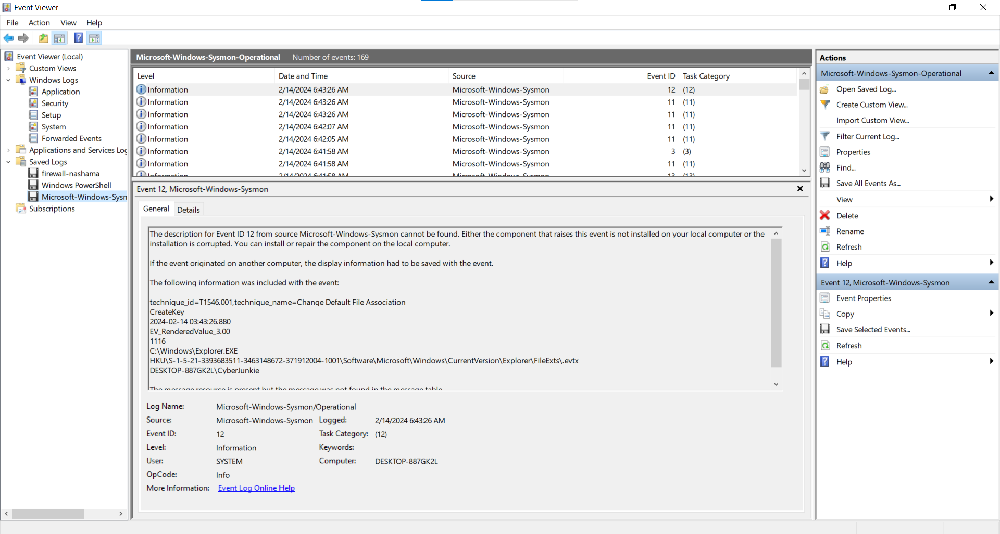

#### Task 1

How many Event logs are there with Event ID 11?

Select `Filter current logs` from the right pane, and filter for event ID 11

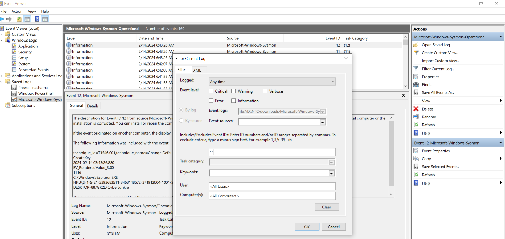

Answer: 56

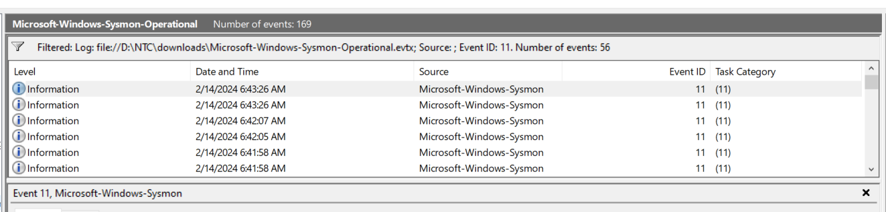

#### Task 2

Whenever a process is created in memory, an event with Event ID 1 is recorded with details such as command line, hashes, process path, parent process path, etc. This information is very useful for an analyst because it allows us to see all programs executed on a system, which means we can spot any malicious processes being executed. What is the malicious process that infected the victim's system?

Here, I've filtered for event ID 1, which tracks process creation and execution, and found an executable named `Preventivo24.02.14.exe.exe`

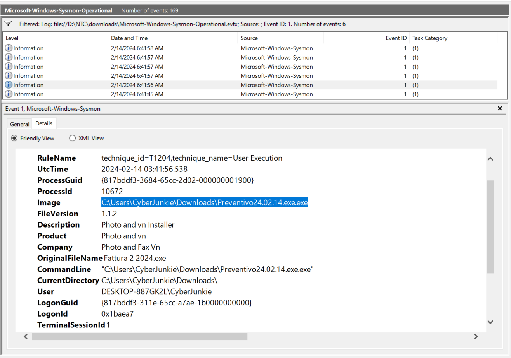

Answer: C:\Users\CyberJunkie\Downloads\Preventivo24.02.14.exe.exe

#### Task 3

Which Cloud drive was used to distribute the malware?

For this task, I've filtered for event ID 22, which is responsible for DNS queries, and got the cloud drive used

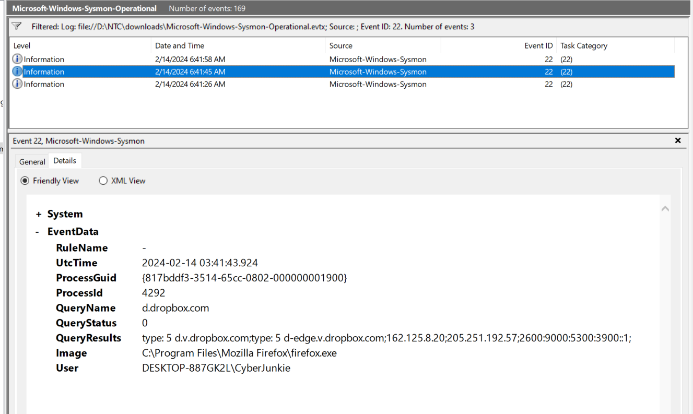

Answer: dropbox

#### Task 4

For many of the files it wrote to disk, the initial malicious file used a defense evasion technique called Time Stomping, where the file creation date is changed to make it appear older and blend in with other files. What was the timestamp changed to for the PDF file?

File creating date changed? it is Event ID 2 for sure, lets filter it:

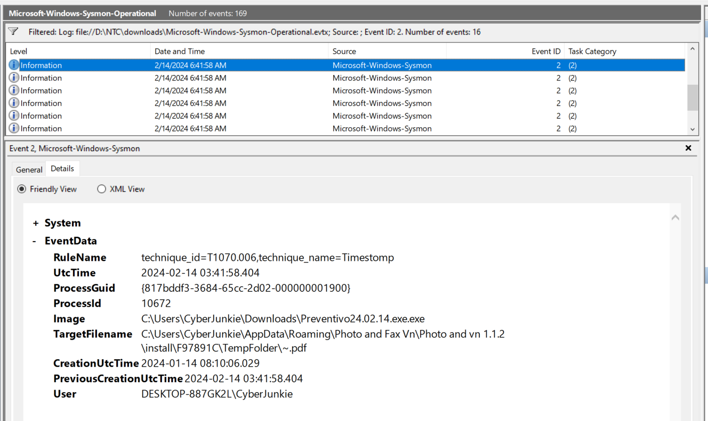

We have only 1 `.pdf` file here, look at `CreationUtcTime` 

Answer: 2024-01-14 08:10:06

#### Task 5

The malicious file dropped a few files on disk. Where was "once.cmd" created on disk? Please answer with the full path along with the filename.

file dropped a few files on disk = File creation? for sure you know that it is event ID 11

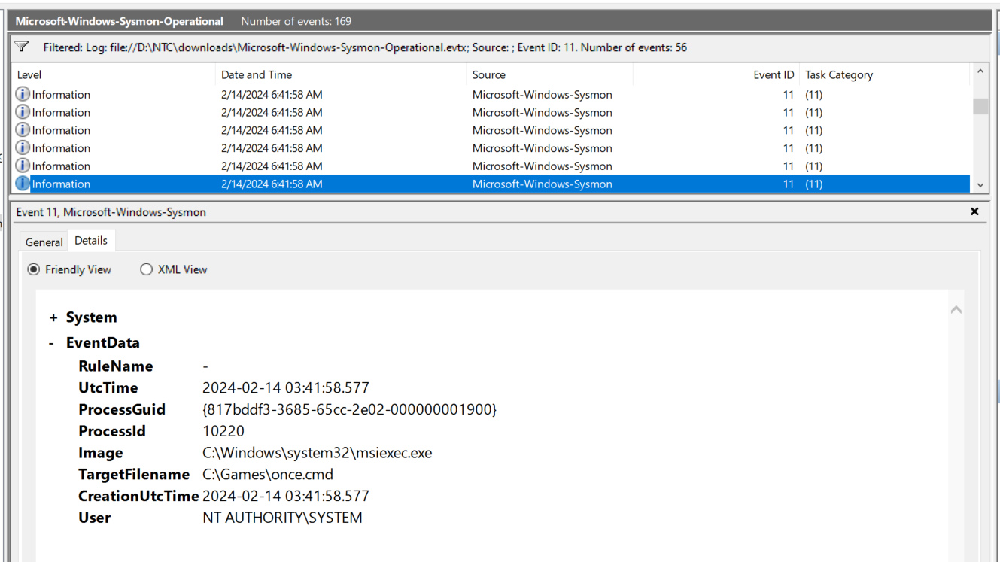

But this isn't the answer, we want the Image to be the malware we know:

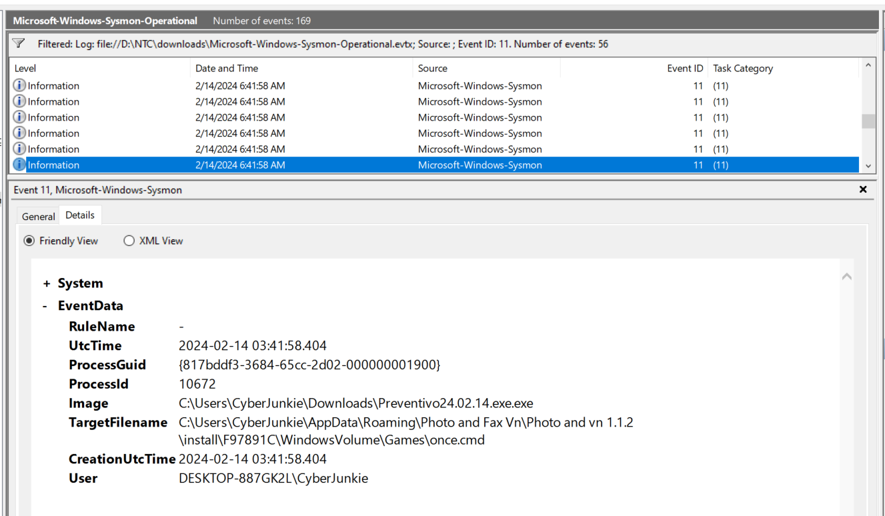

Answer: C:\Users\CyberJunkie\AppData\Roaming\Photo and Fax Vn\Photo and vn 1.1.2\install\F97891C\WindowsVolume\Games\once.cmd

#### Task 6

The malicious file attempted to reach a dummy domain, most likely to check the internet connection status. What domain name did it try to connect to?

Back to event ID 22, there was 3 events, but only on of them is generated from our malware:

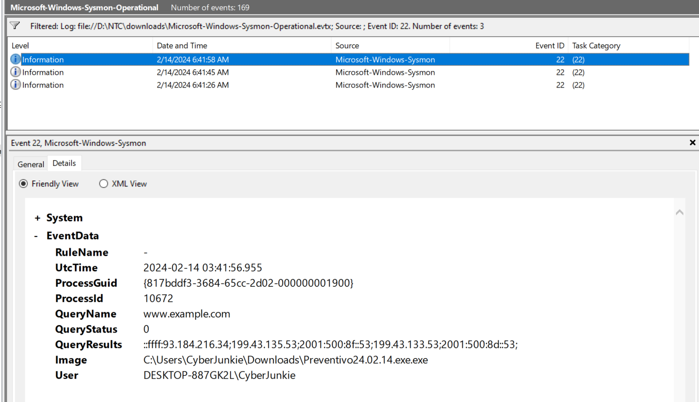

Answer: www.example.com

#### Task 7

Which IP address did the malicious process try to reach out to?

Lets filter for event ID 3 for network connections, we have only 1 event, which shows the answer clearly

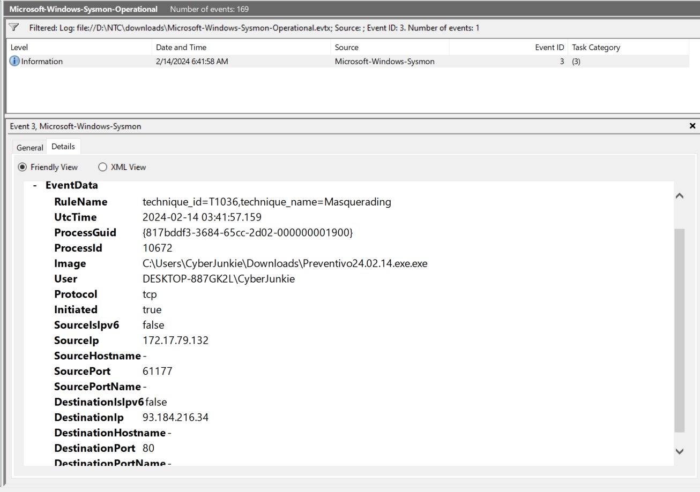

Answer: 93.184.216.34

#### Task 8

The malicious process terminated itself after infecting the PC with a backdoored variant of UltraVNC. When did the process terminate itself?

For process termination, we will check event ID 5, we also have 1 event

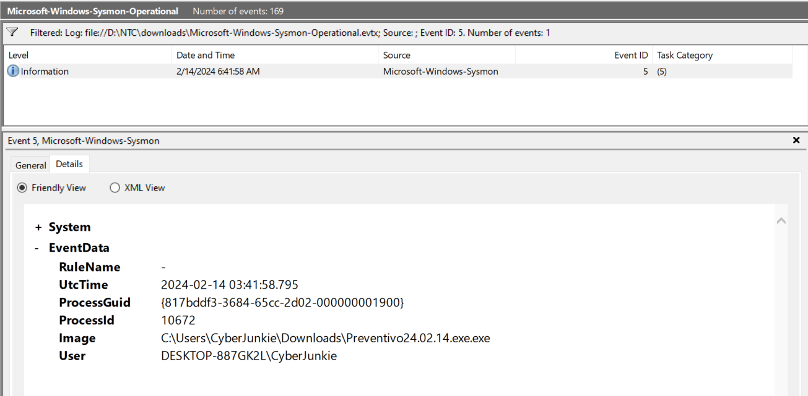

Answer: 2024-02-14 03:41:58

### Final Note

Across this sherlock, most of the tasks we've looked for IDs that contains 1 or 3 logs, and in general the amount of logs was small, which helped us to get the answers directly, but in real world you will usually interact with maybe more than 100,000 log daily, with high amount of false positive, so for sure you will need to filter more and not stop in basic Event ID filter.