### Sherlock Scenario

Alonzo Spire is fascinated by AI after noticing the recent uptick in usage of AI tools to help aid in daily tasks. He came across a sponsored post on social media about an AI tool by Google. The post had a massive reach, and the Page which posted had 200k + followers. Without any second thought, he downloaded the tool provided via the Post. But after installing it he could not find the tool on his system which raised his suspicions. A DFIR analyst was notified of a possible incident on Forela's sysadmin machine. You are tasked to help the analyst in analysis to find the true source of this odd incident.

### Answers

Before reading the questions I've done multiple things:

1. I analyzed the prefetch files and parse them to csv file using PECmd.exe from Eric-Zimmerman tools:

```powershell
 .\PECmd.exe -d D:\NTC\downloads\detroitbecomehuman\Triage\C\Windows\prefetch --csv ./prefetched-detroit
```

2. I did the same for the $MFT using MFTECmd.exe, which is also from Eric-Zimmerman tools:

```powershell
.\MFTECmd.exe -f 'D:\NTC\downloads\detroitbecomehuman\Triage\C\$MFT' --csv . --csvf mft-detroit.csv
```

3. Also I have opened $MFT in the MFTExplorer, In case we needed them in the questions.

#### Task 1

What is the full link of a social media post which is part of the malware campaign, and was unknowingly opened by Alonzo spire?

By looking for the history file in Triage/C/Users/alonzo.spire/AppData/Local/Microsoft/Edge/User Data/Default it is sqlite3 file, so I opened it in sqlitebrowser then executed SQL query to get the history:

```bash
sqlitebrowser History
```

```sqlite3
SELECT datetime(last_visit_time/1000000-11644473600,'unixepoch') AS visit,
        url, title
 FROM urls
 ORDER BY last_visit_time;
```

And finding the answer was easy then:

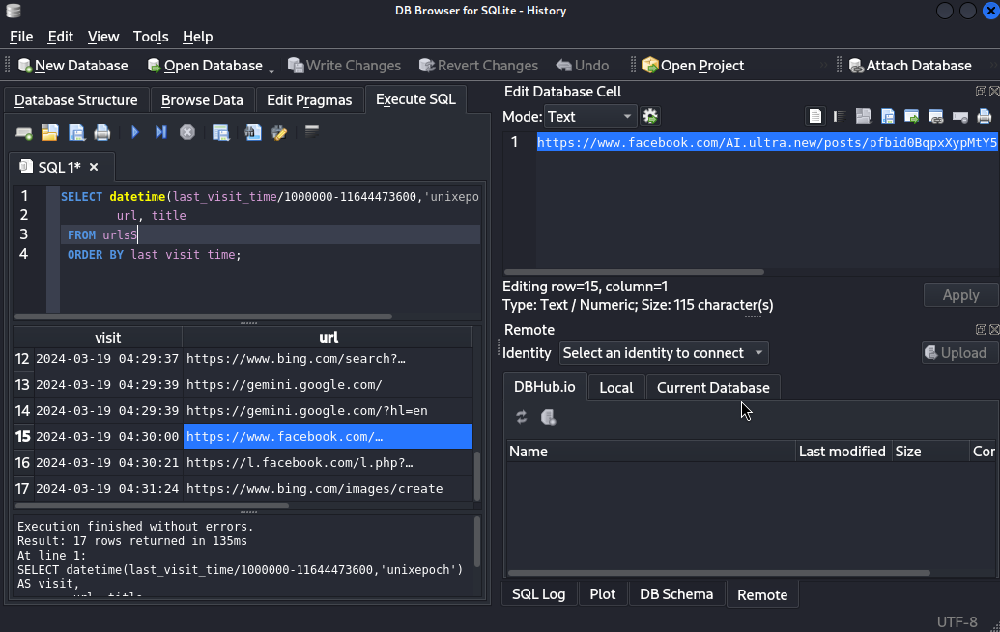

Answer: `https://www.facebook.com/AI.ultra.new/posts/pfbid0BqpxXypMtY5dWGy2GDfpRD4cQRppdNEC9SSa72FmPVKqik9iWNa2mRkpx9xziAS1l`

#### Task 2

Can you confirm the timestamp in UTC when alonzo visited this post?

From the same place.

Answer: `2024-03-19 04:30:00`

#### Task 3

Alonzo downloaded a file on the system thinking it was an AI Assistant tool. What is name of the archive file downloaded?

Now we needed to analyze the $MFT, I opened the csv file and the amount of records was huge, I filtered the Created0x10 column to be greater than `2024-03-19 04:30:00` , to focus on the timeline after the post have been visited by alonzo, also I filtered the column ParentPath to contain both `alonzo` and `Downloads`, and this is the result I've got:

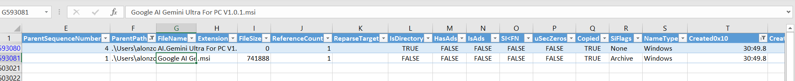

By googling this file name, I found that it is a malware:

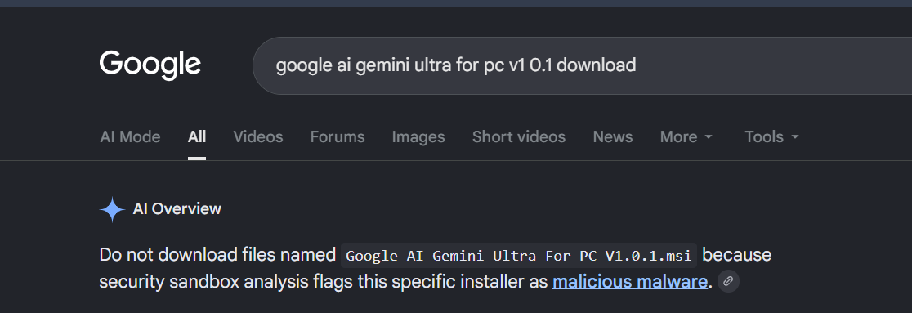


Here is full report from any.run: https://any.run/report/bb7c3b78f2784a7ac3c090331326279476c748087188aeb69f431bbd70ac6407/0ef391d1-20c0-4279-adb6-e89afe28d37f

I tried to submit the answer as it is: AI.Gemini Ultra For PC V1.0.1, but the format includes extension ends with r.

If we gone back to the History file we are opening using Sqlitebrowser and looked for the downloads table we will find the file with the extension.

Answer: AI.Gemini Ultra For PC V1.0.1.rar

#### Task 4

What was the full direct url from where the file was downloaded?

You can find it by looking in the download_url_chains table.

Answer: `https://drive.usercontent.google.com/download?id=1z-SGnYJCPE0HA_Faz6N7mD5qf0E-A76H&export=download`

#### Task 5

Alonzo then proceeded to install the newly download app, thinking that its a legit AI tool. What is the true product version which was installed?

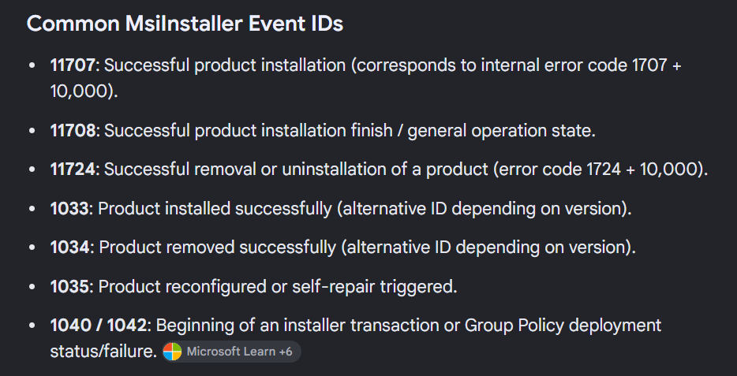

So, lets open Application logs in Event viewer, and look for events related to Gemini, and we are interested in both event IDs 1040 and 1042:

Under event ID 1040 there was only 1 event related to the breach timeline but it wasn't helpful:

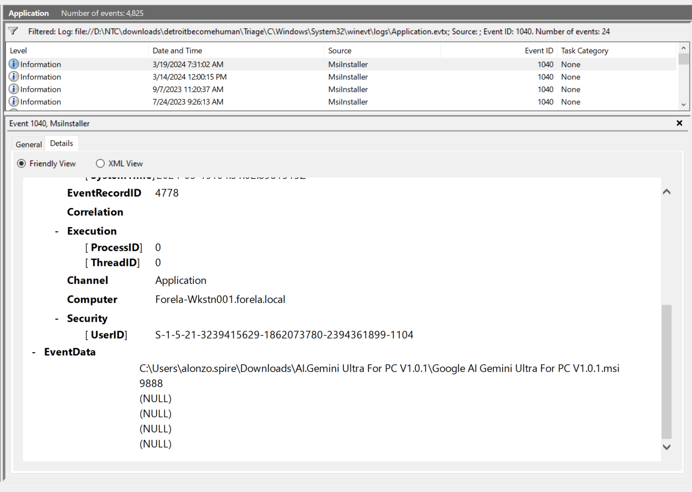

Event ID 1042 returned the same.

Lets look into Event ID 1033: Product installed successfully

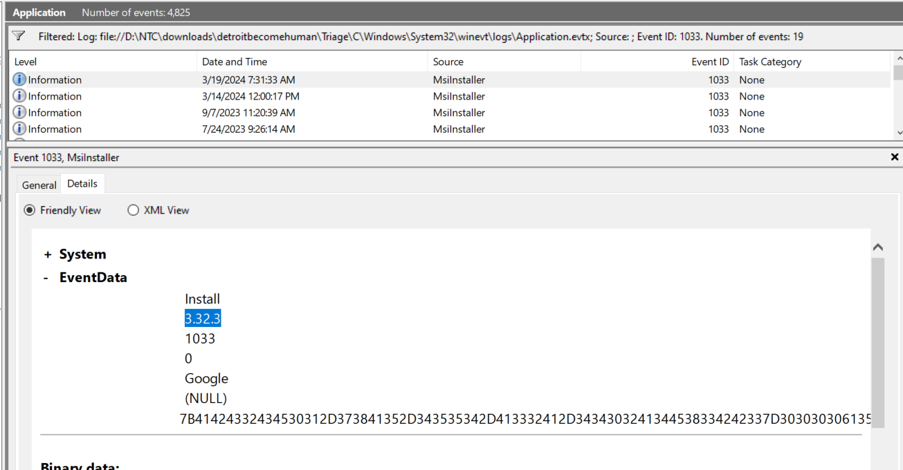

Answer: 3.32.3

#### Task 6

When was the malicious product/package successfully installed on the system?

By taking the time from the same event and converting it to UTC you will got the answer.

Answer: 2024-03-19 04:31:33

#### Task 7

The malware used a legitimate location to stage its file on the endpoint. Can you find out the Directory path of this location?

Nothing was helpful in the $MFT and prefetch files, except that we've noticed powershell execution in our timeline:

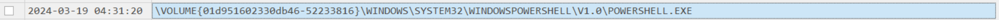

So lets open powershell operational logs, by Filtering for event ID 4104 in the powershell logs, we can track the execution of a Remote Command.

Nothing was helpful in this logs file, but there is another file called windows powershell.evtx

Also nothing helpful, but accually, in this file there is only one event related to the attack timeline, its event ID is 403, I've searched for it, and it means the PowerShell engine state changed from "Available" to "Stopped," marking the normal or forced termination of a script.

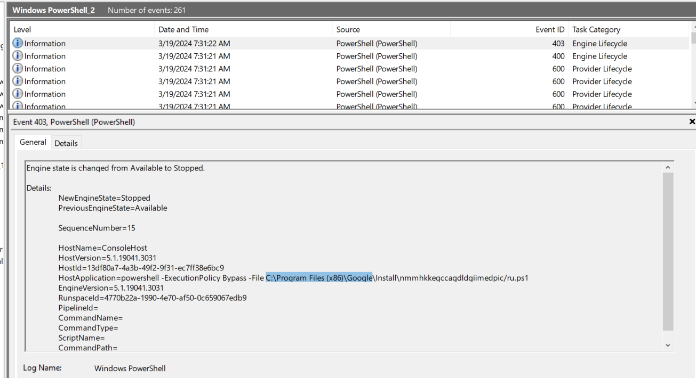

Answer: C:\Program Files (x86)\Google

#### Task 8

The malware executed a command from a file. What is name of this file?

Nothing found for event ID 4688 (Process creation)

I've gone back to the MFT csv file and filtered the parent path column to include C:\Program Files (x86)\Google\Install , and I've got the answer

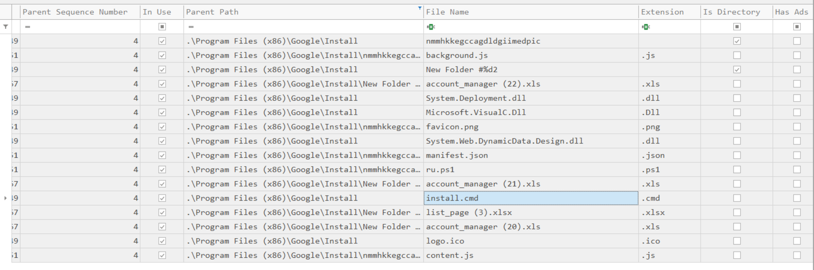

Answer: install.cmd

#### Task 9

What are the contents of the file from question 8? Remove whitespace to avoid format issues.

To answer this task, locate the file in MFTExplorer and look for the ASCII

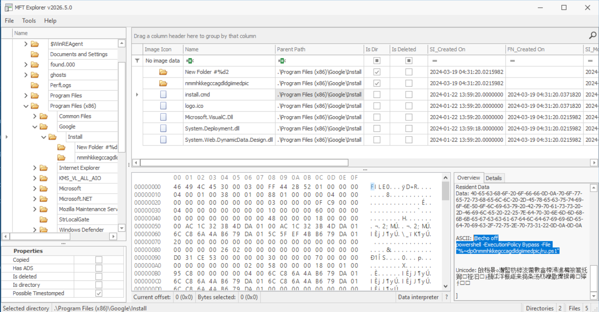

Answer: @echooffpowershell-ExecutionPolicyBypass-File"%~dp0nmmhkkegccagdldgiimedpic/ru.ps1"

#### Task 10

What was the command executed from this file according to the logs?

We can go back to Event ID 403 from the powershell logs and we'll find it:

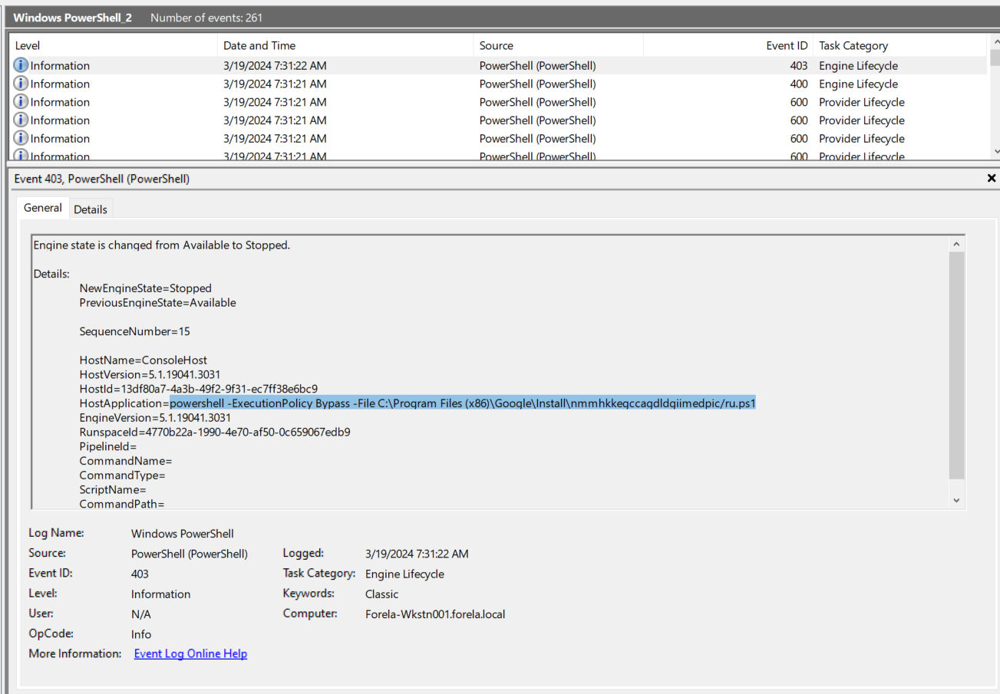

Answer: powershell -ExecutionPolicy Bypass -File C:\Program Files (x86)\Google\Install\nmmhkkegccagdldgiimedpic/ru.ps1

#### Task 11

Under malware staging Directory, a js file resides which is very small in size. What is the hex offset for this file on the filesystem?

If we looked for the JS files in the directory we will find 2, but one of them only holds malicious code, which is content.js:

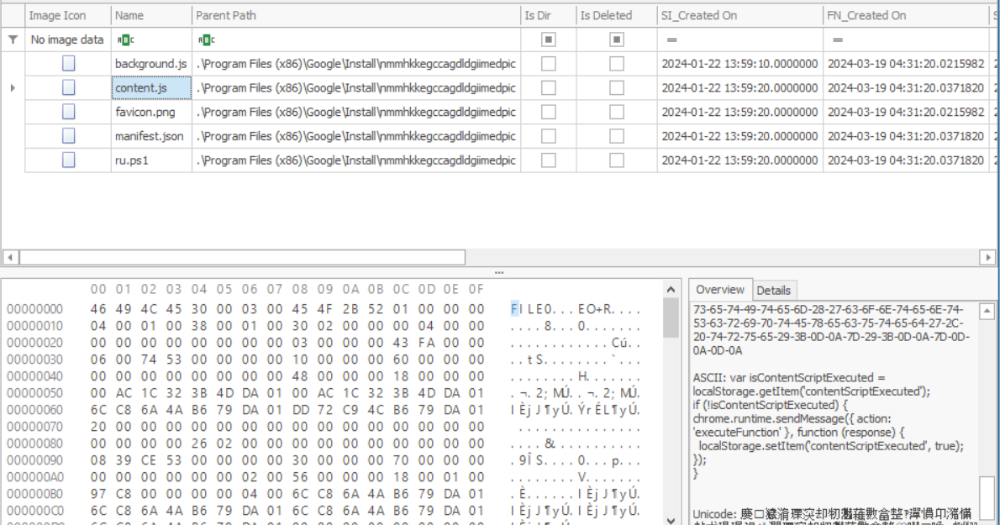

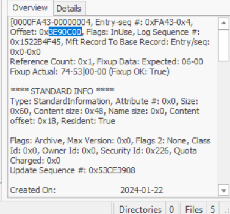

Answer: 3E90C00

#### Task 12

Recover the contents of this js file so we can forward this to our RE/MA team for further analysis and understanding of this infection chain. To sanitize the payload, remove whitespaces.

We've already found the payload from the previous task

Answer: `varisContentScriptExecuted=localStorage.getItem('contentScriptExecuted');if(!isContentScriptExecuted){chrome.runtime.sendMessage({action:'executeFunction'},function(response){localStorage.setItem('contentScriptExecuted',true);});}`

#### Task 13

Upon seeing no AI Assistant app being run, alonzo tried searching it from file explorer. What keywords did he use to search?

By opening Triage/C/Users/alonzo.spire/NTUSER.DAT in Registry Explorer (Another Eric-Zimmerman tool) and following this path: Software\Microsoft\Windows\CurrentVersion\Explorer\WordWheelQuery, you will got the answer

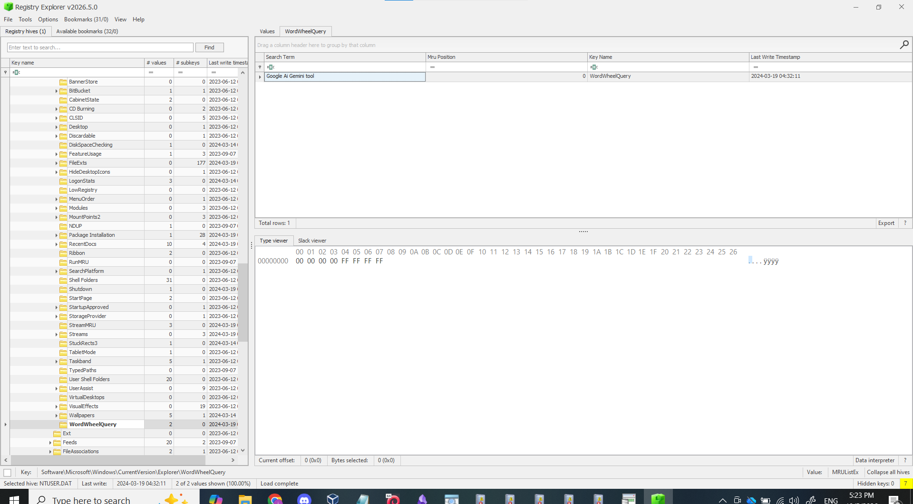

Answer: Google Ai Gemini tool

#### Task 14

When did alonzo searched it?

From the previous task.

Answer: 2024-03-19 04:32:11

#### Task 15

After alonzo could not find any AI tool on the system, he became suspicious, contacted the security team and deleted the downloaded file. When was the file deleted by alonzo?

If we gone back to the screenshot from task 5, we can see alonzo's SID `S-1-5-21-3239415629-1862073780-2394361899-1104`, lets look in the recycle bin with the path including the SID:

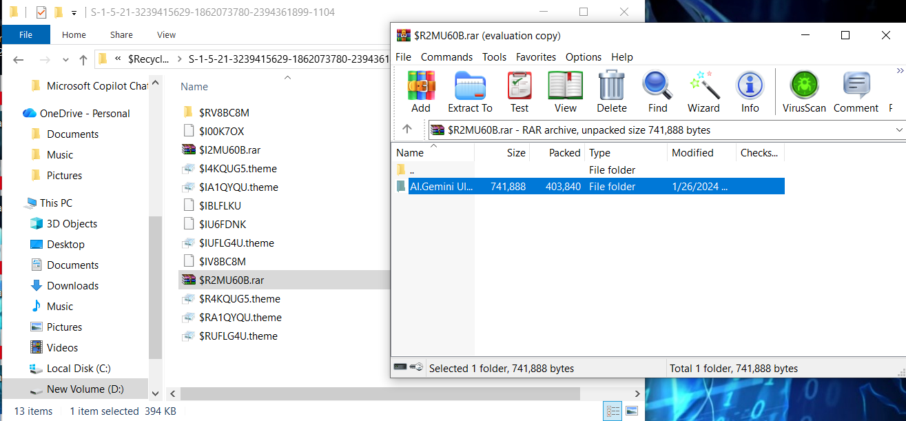

As we can see, $R2MU60B.rar includes the malicious file, and seems like $I2MU60B.rar is the metadata, and as the task is asking for the deletion time, we will look into the metadata.

RBCmd.exe is one of Eric-Zimmerman tool to analyze recycle bin artifacts:

```powershell
.\RBCmd.exe -f 'D:\NTC\downloads\detroitbecomehuman\Triage\C\$Recycle.Bin\S-1-5-21-3239415629-1862073780-2394361899-1104\$I2MU60B.rar'
```

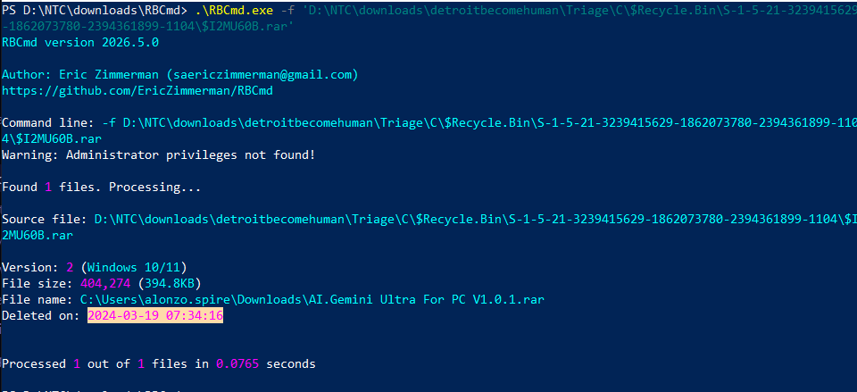

Don't forgot to convert it to UTC

Answer: 2024-03-19 04:34:16

#### Task 16

Looking back at the starting point of this infection, please find the md5 hash of the malicious installer.

I thought to extract $R2MU60B.rar and take the hash, but the zip is password protected.

If we simply gone back to the any.run report we can get it easely:

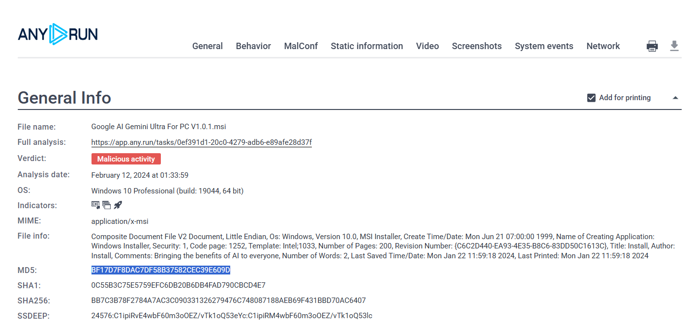

Answer: BF17D7F8DAC7DF58B37582CEC39E609D

