### Sherlock Scenario

Simon Stark is a dev at forela who recently planned to stream some coding sessions with colleagues on which he received appreciation from CEO and other colleagues too. He unknowingly installed a well known streaming software which he found by google search and was one of the top URL being promoted by google ads. Unfortunately things took a wrong turn and a security incident took place. Analyze the triaged artifacts provided to find out what happened exactly.

### Answers

Before reading the questions I've done multiple things:

1. I analyzed the prefetch files and parse them to csv file using PECmd.exe from Eric-Zimmerman tools:

```powershell
.\PECmd.exe -d D:\NTC\downloads\Streamer\Streamer\Acquisition\C\Windows\prefetch\ --csv ./prefetched-streamer
```

2. I did the same for the $MFT using MFTECmd.exe, which is also from Eric-Zimmerman tools:

```powershell
 .\MFTECmd.exe -f 'D:\NTC\downloads\Streamer\Streamer\Acquisition\C\$MFT' --csv . --csvf mft-streamer.csv
```

3. Also, I have opened $MFT in the MFTExplorer, In case we needed them in the questions.

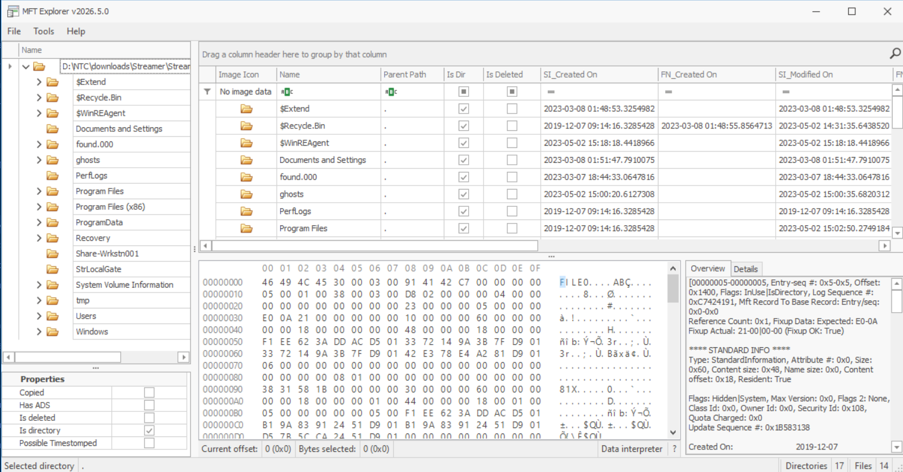

4. Also, I've opened the MFT and Prefetch CSVs in the timeline explorer to be ready.

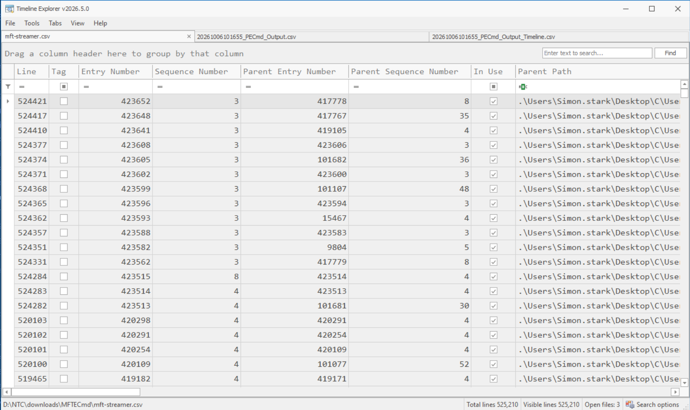

5. I opened simon.stark's NTUSER.DAT in the registery explorer in case we need it

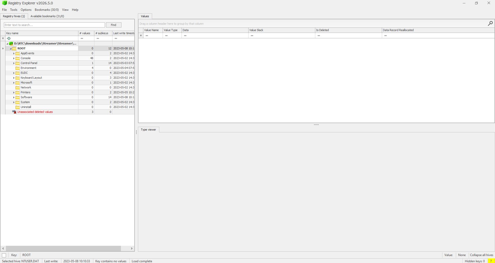

#### Task 1

What's the original name of the malicious zip file which the user downloaded thinking it was a legit copy of the software?

I've gone to Streamer/Acquisition/C/Users/Simon.stark/AppData/Local/Microsoft/Edge/User Data/Default and opened History in SQLiteBrowser to check the download history:

```bash
sqlitebrowser History 
```

The only file You'll find in the downloads table is C:\Users\Simon.stark\Downloads\PHP-Secure-Session-master.zip, but this isn't the answer.

Also I've gone to the MFT CSV and filtered the parent path to include only the files on Simon Stark's Downloads directory:

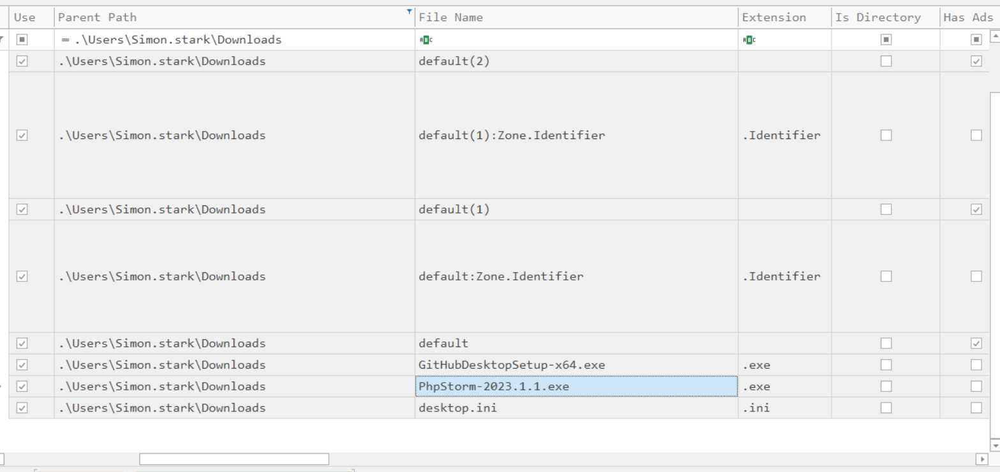

But Also the answer isn't here.

Lets look into the recycle bin, there is two SIDs, simon's SID is S-1-5-21-3239415629-1862073780-2394361899-1602 as you can see it inside his directory

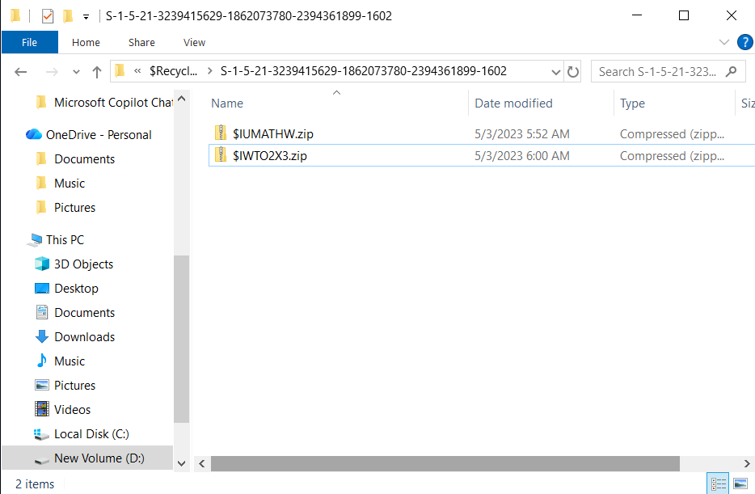

We have 2 ZIP files but we can't open them, lets check RBCmd.exe:

```powershell
.\RBCmd.exe -f 'D:\NTC\downloads\Streamer\Streamer\Acquisition\C\$Recycle.Bin\S-1-5-21-3239415629-1862073780-2394361899-1602\$IUMATHW.zip'

.\RBCmd.exe -f 'D:\NTC\downloads\Streamer\Streamer\Acquisition\C\$Recycle.Bin\S-1-5-21-3239415629-1862073780-2394361899-1602\$IWTO2X3.zip'
```

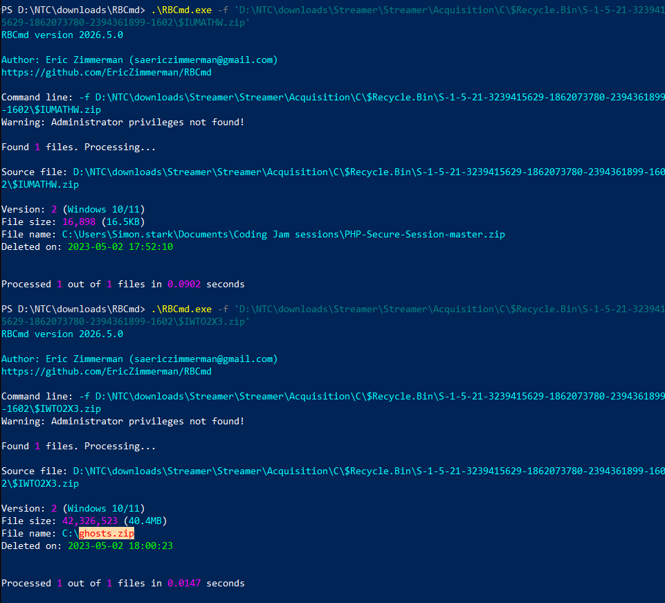

Also It wasn't helpful.

But if we go to Simon's recent folder we will find the answer directly, it was simpler than I thought

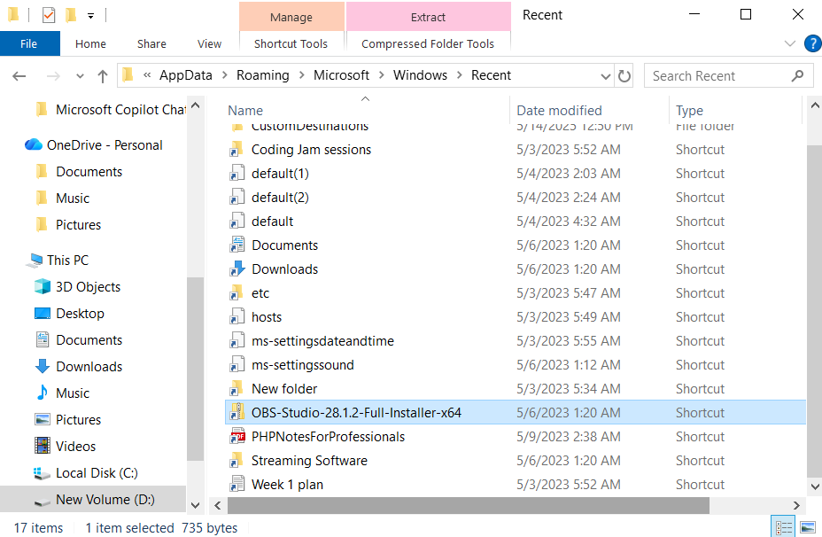

Answer: OBS-Studio-28.1.2-Full-Installer-x64.zip

#### Task 2

Simon Stark renamed the downloaded zip file to something else. What's the renamed Name of the file alongside the full path?

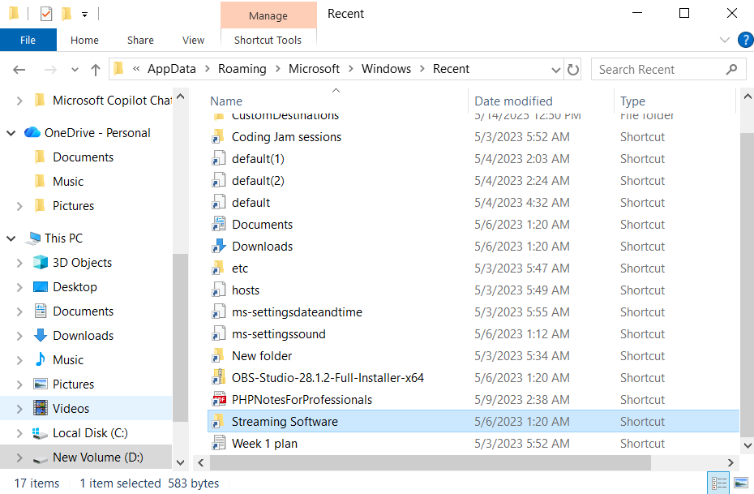

Is it C:\Users\Simon.stark\Documents\Streaming Software? No

Lets try to analyze the USN journal, maybe we can locate something useful:

```powershell
 .\MFTECmd.exe -f 'D:\NTC\downloads\Streamer\Streamer\Acquisition\C\$Extend\$J' --csv J-Streamer.csv
```

As we can see, the malicious file have been installed at 2023-05-05 10:19:46, so we will look for the files changes after this timestamp

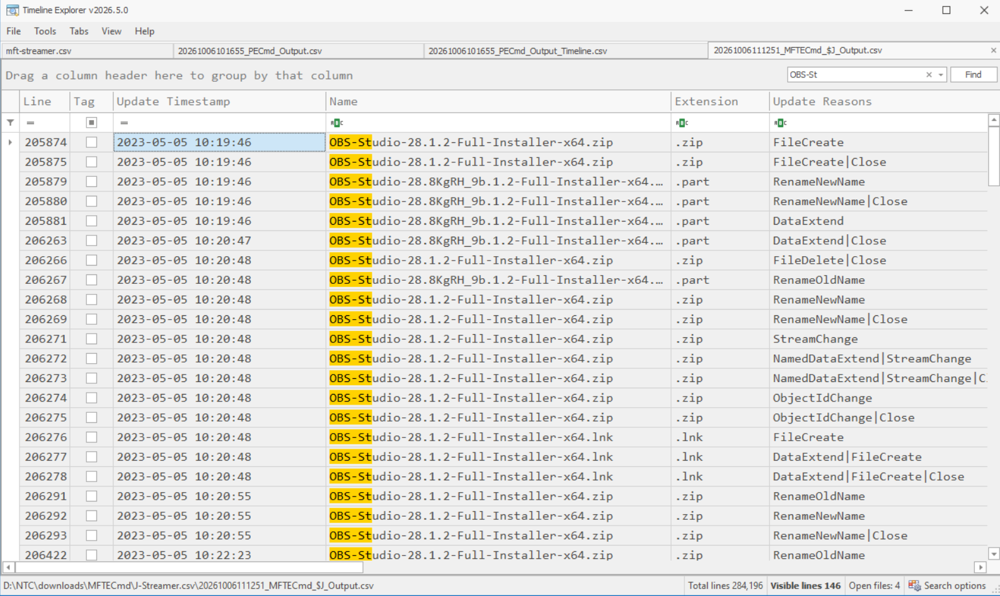

Mostly we've found it : Obs Streaming Software.zip

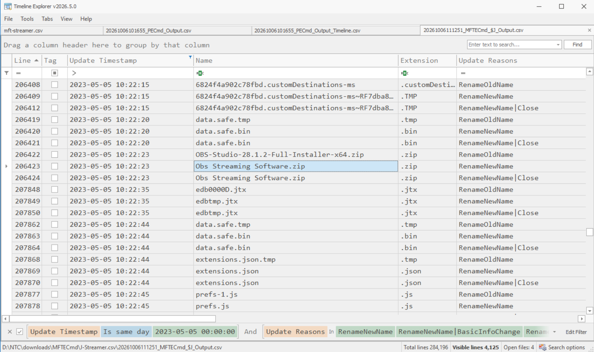

I've searched for the file name in the PECmd output CSV file and found it

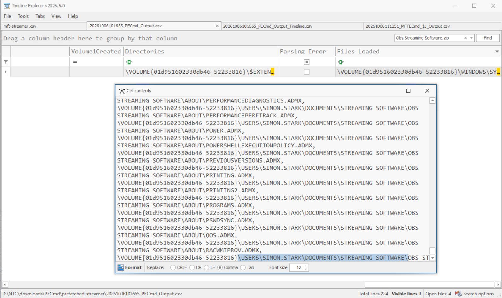

Answer: C:\Users\Simon.stark\Documents\Streaming Software\Obs Streaming Software.zip

#### Task 3

What's the timestamp when the file was renamed?

We already located it in the USN Journal CSV:


Answer: 2023-05-05 10:22:23

#### Task 4

What's the Full URL from where the software was downloaded?

By searching for the original file name in the MFT CSV, You'll locate the answer under the Zone ID Content Column

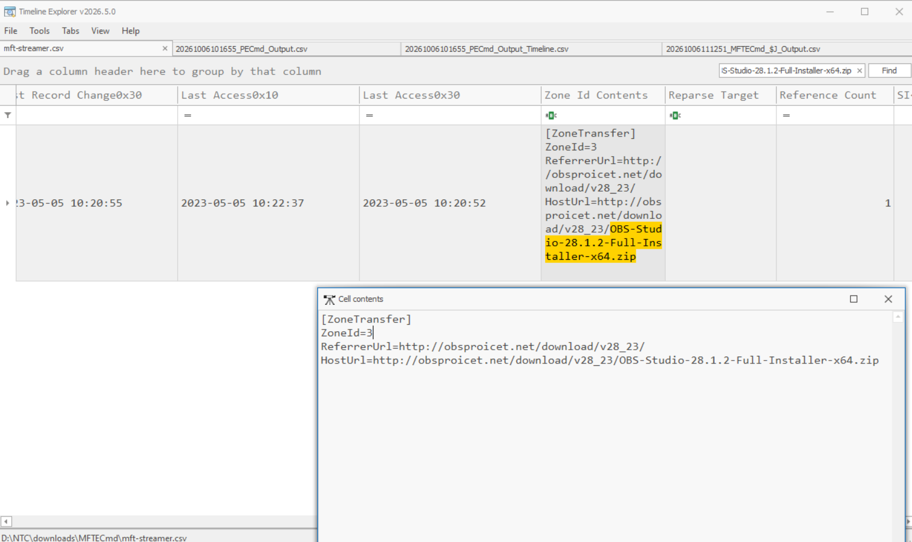


Answer: http://obsproicet.net/download/v28_23/OBS-Studio-28.1.2-Full-Installer-x64.zip

#### Task 5

Dig down deeper and find the IP Address on which the malicious domain was being hosted.

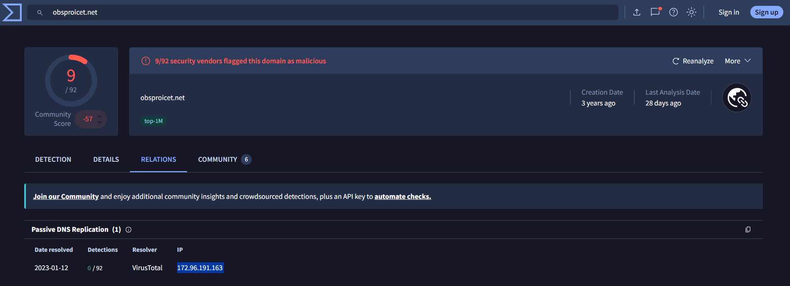

The IP provided in Virustotal is incorrect.

Searching by Whois and dig wasn't helpful.

Also, I've tried to look into DNS client operational logs file, but there wasn't any events in the same day:

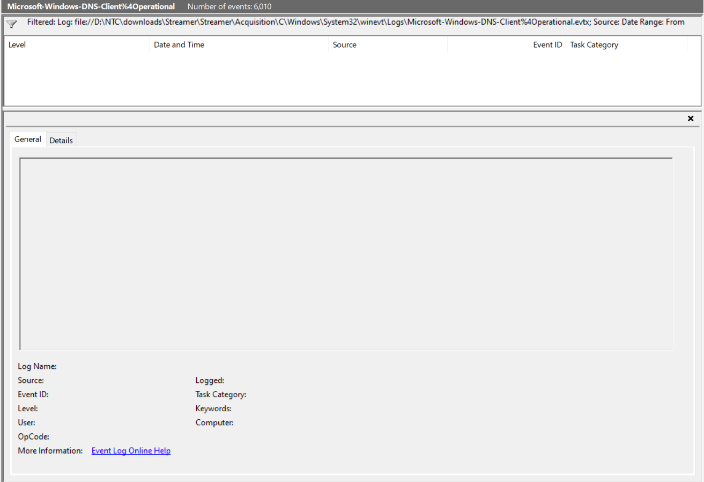

Lets try to analyze all of the event logs files using EvtxECmd by Eric-Zimmerman:

```powershell
.\EvtxECmd.exe -d D:\NTC\downloads\Streamer\Streamer\Acquisition\C\Windows\System32\winevt\Logs\ --csv . --csvf evtx.csv
```

I've filtered for event ID 3008 (query completed), and searched for the domain name, then the answer apeared:

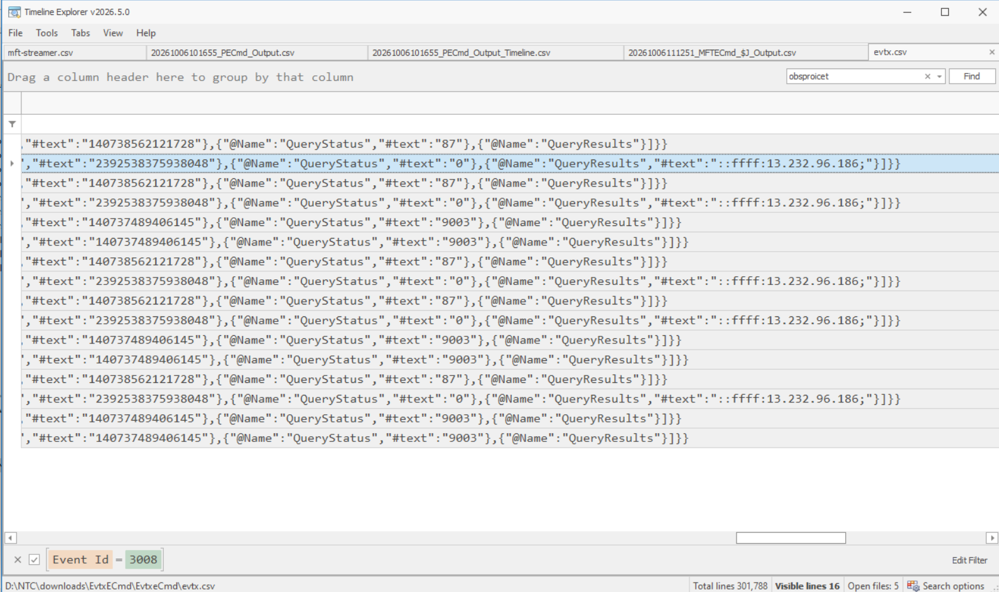

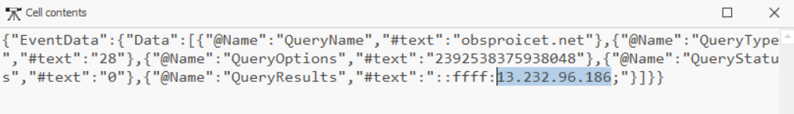

Answer: 13.232.96.186

#### Task 6

Multiple Source ports connected to communicate and download the malicious file from the malicious website. Answer the highest source port number from which the machine connected to the malicious website.

We can get it by simply read the content of pfirewall.log in Streamer/Acquisition/C/Windows/System32/LogFiles/Firewall and filter for the IP Address:

```bash
grep '13.232.96.186' pfirewall.log
```

Answer: 50045

#### Task 7

The zip file had a malicious setup file in it which would install a piece of malware and a legit instance of OBS studio software so the user has no idea they got compromised. Find the hash of the setup file.

`AmCache` refers to a Windows registry file which is used to store evidence related to program execution.

The information that it contains include the execution path, first executed time, deleted time, and first installation. It also provides the **file hash** for the executables.

On Windows OS the AmCache hive is located at `C:\Windows\AppCompat\Programs\AmCache.hve

We can analyze it using Eric-Zimmerman's AmchacheParser tool:

```powershell
.\AmcacheParser.exe -f D:\NTC\downloads\Streamer\Streamer\Acquisition\C\Windows\AppCompat\Programs\Amcache.hve --csv ./amcache-streamer
```

Then open the UnassociatedFileEntries file in timeline explorer and search for the executable name:

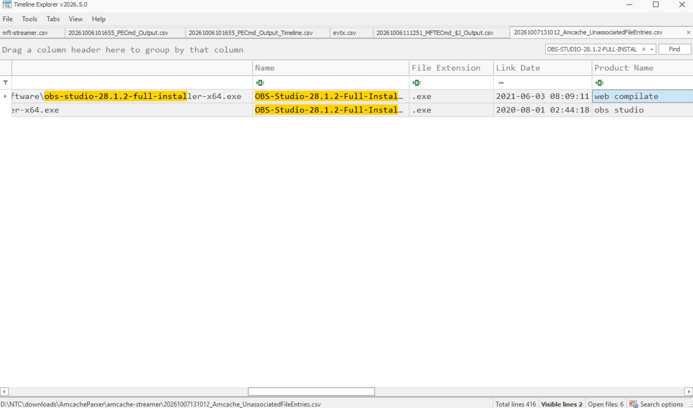

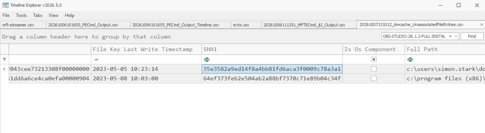

Take the hash from the web compilate one.

Answer: 35e3582a9ed14f8a4bb81fd6aca3f0009c78a3a1

#### Task 8

The malicious software automatically installed a backdoor on the victim's workstation. What's the name and filepath of the backdoor?

By sorting the Created 0x10 column in the MFT records and looking for the executables after the installer you will find something weird:

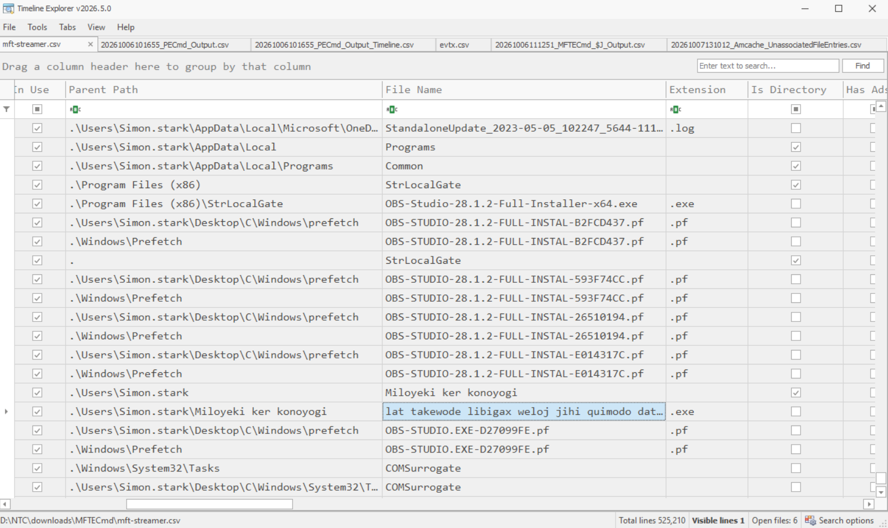

Answer: C:\Users\Simon.stark\Miloyeki ker konoyogi\lat takewode libigax weloj jihi quimodo datex dob cijoyi mawiropo.exe

#### Task 9

Find the prefetch hash of the backdoor.

By simply looking for the prefetch files names, a prefetch filename is `<EXENAME>-<HASH>.pf`, where the 8 hex characters after the last dash are the prefetch hash (computed from the executable's full path, and for some hosting processes the command line too).

In our case the file name is LAT TAKEWODE LIBIGAX WELOJ JI-D8A6D943.pf

Answer: D8A6D943

#### Task 10

The backdoor is also used as a persistence mechanism in a stealthy manner to blend in the environment. What's the name used for persistence mechanism to make it look legit?

If we looked in the USN Journal CSV after the backdoor have been launched, we will notice a scheduled task that have been created:

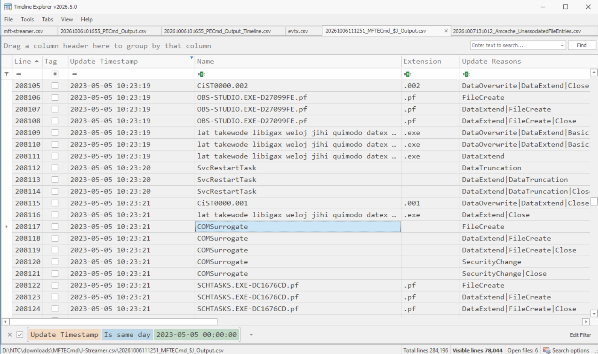

Answer: COMSurrogate

#### Task 11

What's the bogus/invalid randomly named domain which the malware tried to reach?

In the EvtxECmd CSV, filter to the `Microsoft-Windows-DNS-Client/Operational` channel and narrow the time window to just after the backdoor first executed, then "Bogus/invalid" suggests it never resolved, I checked event ID 3008 (query completed) and by following the timeline I've founded a weird domain:

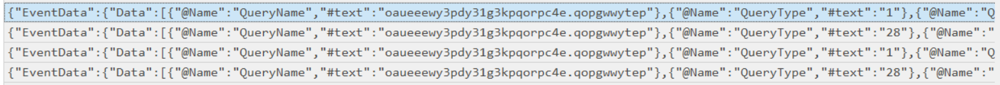

Answer: oaueeewy3pdy31g3kpqorpc4e.qopgwwytep

#### Task 12

The malware tried exfiltrating the data to a s3 bucket. What's the url of s3 bucket?

Using the same filters from the previous task, I just searched for s3 and followed the timeline:

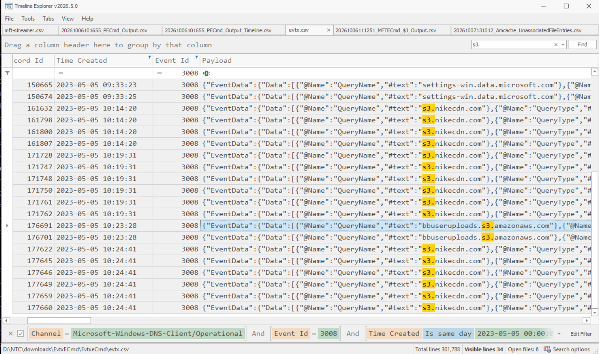

Answer: bbuseruploads.s3.amazonaws.com

#### Task 13

What topic was simon going to stream about in week 1? Find a note or something similar and recover its content to answer the question.

In Streamer/Acquisition/C/Users/Simon.stark/AppData/Roaming/Microsoft/Windows/Recent you will find a .lnk file called Week 1 plan.lnk, by looking in its strings it leads to C:\Users\Simon.stark\Documents\Coding Jam sessions\Week 1 plan.txt

So I located the file in the MFTExplorer and looked for the ASCII section:

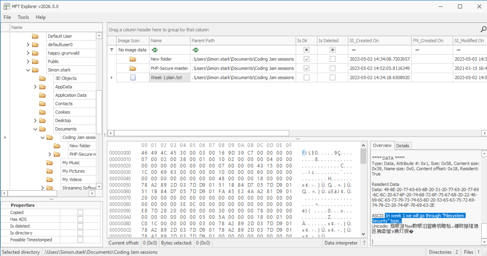

Answer: Filesystem Security

#### Task 14

What's the name of Security Analyst who triaged the infected workstation?

Shellbags record every folder browsed in Explorer, including network shares, so the analyst navigating to the tools folder would be captured there.
To analyze shellbags, we will use Eric-Zimmerman's SBECmd:

Then I've opened `Simon.stark_NTUSER.csv` in the timeline explorer:

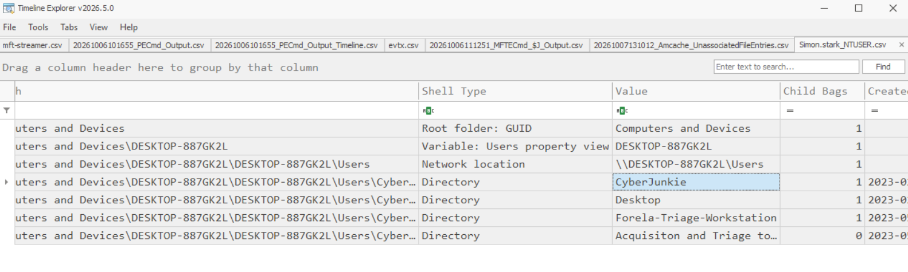

Answer: CyberJunkie
#### Task 15

What's the network path from where acquisition tools were run?

From the same file in the previous question:

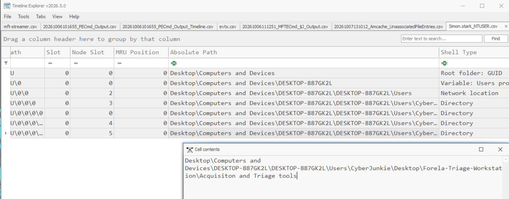

Answer: `\\DESKTOP-887GK2L\Users\CyberJunkie\Desktop\Forela-Triage-Workstation\Acquisiton and Triage tools`

