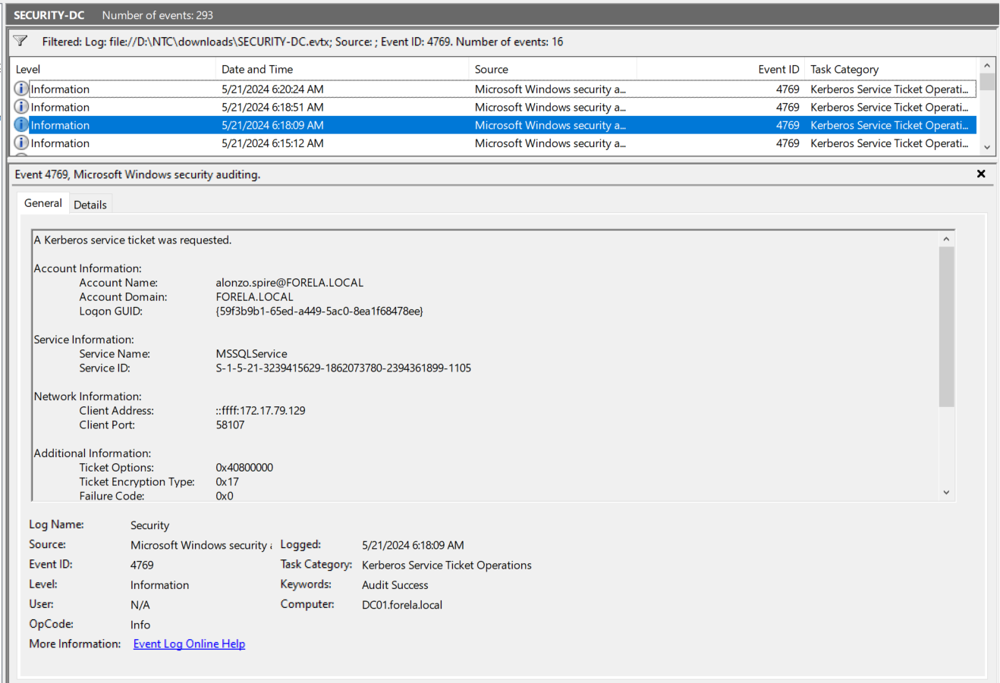
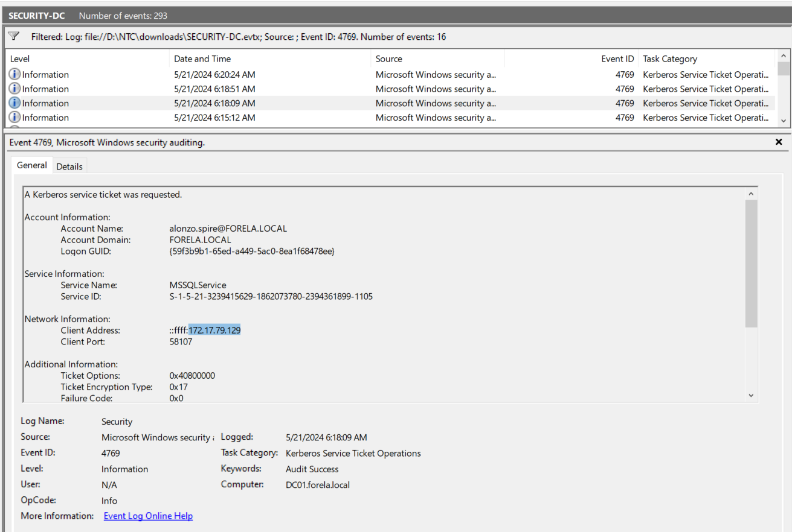
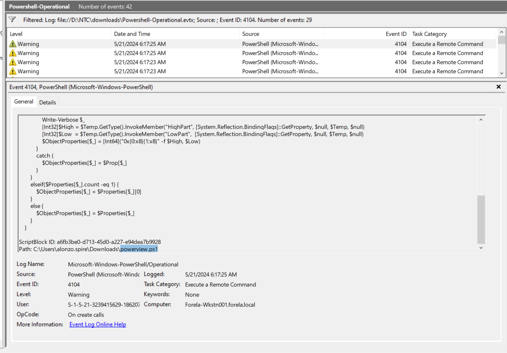
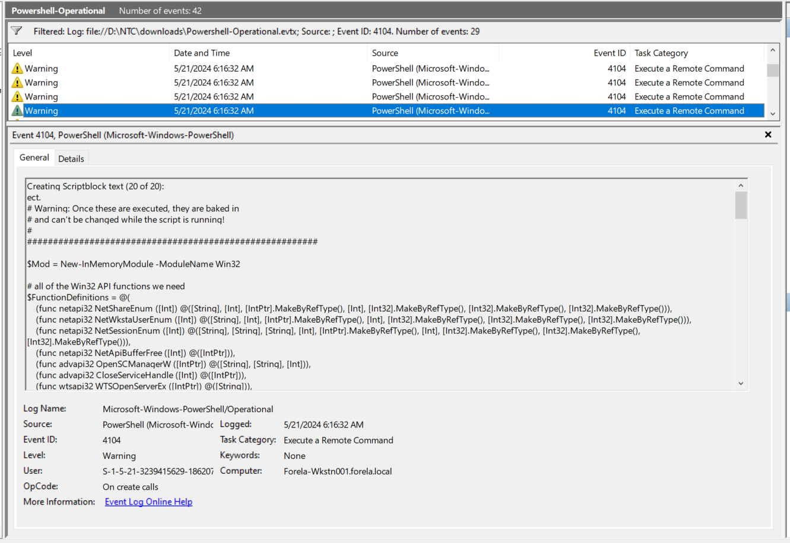
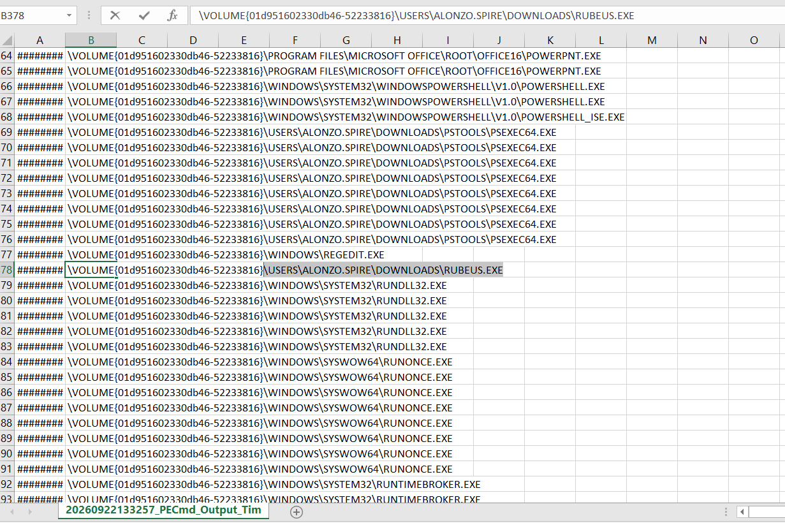
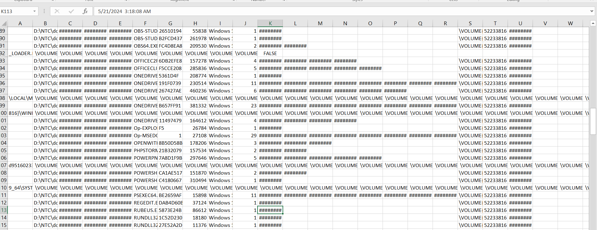

### Sherlock Scenario

Alonzo Spotted Weird files on his computer and informed the newly assembled SOC Team. Assessing the situation it is believed a Kerberoasting attack may have occurred in the network. It is your job to confirm the findings by analyzing the provided evidence.

You are provided with:

1- Security Logs from the Domain Controller

2- PowerShell-Operational Logs from the affected workstation

3- Prefetch Files from the affected workstation

### Answers

After decompressing the file, we've got 2 event logs files, one for the DC, and the another one for powershell. Also, we've got 70+ prefetch files.

#### Task 1

Analyzing Domain Controller Security Logs, can you confirm the UTC date & time when the kerberoasting activity occurred?

When a `TGS` is requested, an event log with ID `4769` is generated, This event ID should be grouped by the user requesting the tickets and the machine the requests originated from. 

lets filter for this event and check.

After filtering, we've got logs related to multiple services: `DC01$`, `MSSQLService`, `FORELA-WKSTN001$`, `krbtgt`.

The hint: In Security Logs, Filter for Event ID 4769. Now Look for any event where the service name is NOT( krbtgt or ends with $ (For e.g DC01$ ) ). The ticket type should be 0x17 which is for RC4 type encryption. The failure code should be 0x0. The event that matches all the above conditions is the event detailing information about the kerberoasting attack activity.

So after following the hint, the only applicable service is `MSSQLService`.



2024-05-21 06:18:09 -> 2024-05-21 03:18:09 (UTC)

Answer: 2024-05-21 03:18:09
#### Task 2

What is the Service Name that was targeted?

Answer: MSSQLService

#### Task 3

It is really important to identify the Workstation from which this activity occurred. What is the IP Address of the workstation?

We need the client IP from the same event:



Answer: 172.17.79.129

#### Task 4

Now that we have identified the workstation, a triage including PowerShell logs and Prefetch files are provided to you for some deeper insights so we can understand how this activity occurred on the endpoint. What is the name of the file used to Enumerate Active directory objects and possibly find Kerberoastable accounts in the network?

Lets filter for event ID 4104 which records PowerShell [Script Block Logging](https://www.redsecuretech.co.uk/blog/post/event-id-4104-4103-catch-malicious-powershell-scripts/942) events in Windows, capturing the full content of commands and scripts processed by the engine.

We'll notice that all executions have been made using `powerview.ps1`



Answer: powerview.ps1

#### Task 5

When was this script executed? (UTC)



2024-05-21 06:16:32 -> 2024-05-21 03:16:32 (UTC)

Answer: 2024-05-21 03:16:32

#### Task 6

What is the full path of the tool used to perform the actual kerberoasting attack?

Here, we'll need to analyze the prefetch files.

`Prefetch` is a Windows operating system feature that helps optimize the loading of applications by preloading certain components and data. Prefetch files are created for every program that is executed on a Windows system, and this includes both installed applications and standalone executables. The naming convention of Prefetch files is indeed based on the original name of the executable file, followed by a hexadecimal value of the path where the executable file resides, and it ends with the `.pf` file extension.

Eric Zimmerman provides a tool for prefetch files: `PECmd`.

For easier analysis, we can convert the prefetch data into CSV as follows.

```powershell
 .\PECmd.exe -d D:\NTC\downloads\Prefetch\ --csv D:\NTC\downloads\PECmd\Prefetched
```

The output have been saved in `D:\NTC\downloads\PECmd\Prefetched\20260922133257_PECmd_Output_Timeline.csv` and `D:\NTC\downloads\PECmd\Prefetched\20260922133257_PECmd_Output.csv`.

By checking in PECmd_Output_Timeline.csv, you will find multiple executed files, and as per general knowledge `Rubeus` is one of the most used tools to do kerberoasting, and by searching you will find the full path:



Answer: C:\Users\Alonzo.spire\Downloads\Rubeus.exe

#### Task 7

When was the tool executed to dump credentials? (UTC)

By looking for the `Last Run` in PECmd_Output (Column K), we got the answer `5/21/2024  3:18:08 AM` 



Answer: 2024-05-21 03:18:08