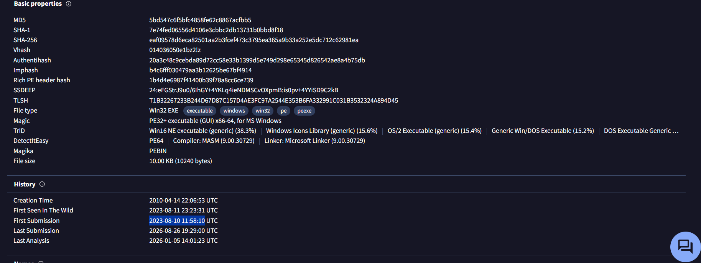

### Sherlock Scenario

Your SIEM system generated multiple alerts in less than a minute, indicating potential C2 communication from Simon Stark's workstation. Despite Simon not noticing anything unusual, the IT team had him share screenshots of his task manager to check for any unusual processes. No suspicious processes were found, yet alerts about C2 communications persisted. The SOC manager then directed the immediate containment of the workstation and a memory dump for analysis. As a memory forensics expert, you are tasked with assisting the SOC team at Forela to investigate and resolve this urgent incident.

### Answers

We've provided with a memory dump, I've tried to analyze it using Volatility2, but it took ages and haven't returned any results, so I've moved to [volatility3](https://github.com/volatilityfoundation/volatility3.git)

We will start by knowing the image info:

```bash
vol -f ~/Desktop/CDSA/RogueOne/20230810.mem windows.info
```

```text
Variable        Value

Kernel Base     0xf80178400000
DTB     0x16a000
Symbols file:///home/ibrahim-qasem/Desktop/volatility3/volatility3/symbols/windows/ntkrnlmp.pdb/3789767E34B7A48A3FC80CE12DE18E65-1.json.xz
Is64Bit True
IsPAE   False
layer_name      0 WindowsIntel32e
memory_layer    1 FileLayer
KdVersionBlock  0xf8017900f398
Major/Minor     15.19041
MachineType     34404
KeNumberProcessors      8
SystemTime      2023-08-10 11:32:00+00:00
NtSystemRoot    C:\WINDOWS
NtProductType   NtProductWinNt
NtMajorVersion  10
NtMinorVersion  0
PE MajorOperatingSystemVersion  10
PE MinorOperatingSystemVersion  0
PE Machine      34404
PE TimeDateStamp        Mon Nov 24 23:45:00 2070
```

#### Task 1

Please identify the malicious process and confirm process id of malicious process.

So, we will need to list the processes:

```bash
vol -f ~/Desktop/CDSA/RogueOne/20230810.mem windows.pslist
```

The output haven't give me a clear malicious process name, but I looked into the process tree, so I can indicate if there is a suspicious thing:

```bash
vol -f ~/Desktop/CDSA/RogueOne/20230810.mem windows.pstree
```

Upon investigating the pstree output, I've noticed that svchost.exe is running from the Downloads directory instead of `C:\Windows\System32` which is suspicious:

```text
6812        7436    svchost.exe     0x9e8b87762080  3       -       1       False   2023-08-10 11:30:03.000000 UTC  N/A     \Device\HarddiskVolume3\Users\simon.stark\Downloads\svchost.exe "C:\Users\simon.stark\Downloads\svchost.exe"  C:\Users\simon.stark\Downloads\svchost.exe
```

Answer: 6812

#### Task 2

The SOC team believe the malicious process may spawned another process which enabled threat actor to execute commands. What is the process ID of that child process?

From the previous output, if we looked to its child process we will got the answer:

```text
**** 4364       6812    cmd.exe 0x9e8b8b6ef080  1       -       1       False   2023-08-10 11:30:57.000000 UTC  N/A     \Device\HarddiskVolume3\Windows\System32\cmd.exe        C:\WINDOWS\system32\cmd.exe     C:\WINDOWS\system32\cmd.exe
```

Answer: 4364

#### Task 3

The reverse engineering team need the malicious file sample to analyze. Your SOC manager instructed you to find the hash of the file and then forward the sample to reverse engineering team. Whats the md5 hash of the malicious file?

For this we will need first to dump the process image, then we can get the hash:

```bash
mkdir -p dump
vol -f ~/Desktop/CDSA/RogueOne/20230810.mem -o ~/Desktop/CDSA/RogueOne/dump windows.pslist --pid 6812 --dump 
```

```bash
md5sum dump/*6812*
```

But the answer is incorrect, so we will try another technique, lets try to extract the file as Windows cached it:

```bash
mkdir -p files 
vol -f ~/Desktop/CDSA/RogueOne/20230810.mem -o files windows.dumpfiles --pid 6812 
```

```bash
md5sum files/*svchost.exe*
```

Answer: 5bd547c6f5bfc4858fe62c8867acfbb5

#### Task 4

In order to find the scope of the incident, the SOC manager has deployed a threat hunting team to sweep across the environment for any indicator of compromise. It would be a great help to the team if you are able to confirm the C2 IP address and ports so our team can utilise these in their sweep.

By simply running netstat and looking for the Foreign IP and port associated with the malicious PID you will find what you are looking for: 

```bash
vol -f ~/Desktop/CDSA/RogueOne/20230810.mem windows.netstat 
```

Answer: 13.127.155.166:8888

#### Task 5

We need a timeline to help us scope out the incident and help the wider DFIR team to perform root cause analysis. Can you confirm time the process was executed and C2 channel was established?

The answer is in the same exact line.

Answer: 10/08/2023 11:30:03

#### Task 6

What is the memory offset of the malicious process?

We can find it from the text output in Task 1

Answer: 0x9e8b87762080

#### Task 7

You successfully analyzed a memory dump and received praise from your manager. The following day, your manager requests an update on the malicious file. You check VirusTotal and find that the file has already been uploaded, likely by the reverse engineering team. Your task is to determine when the sample was first submitted to VirusTotal.

By taking the MD5 hash that we got previously and search for it in virus total, we can find the first submission under the Details section:



Answer: 10/08/2023 11:58:10