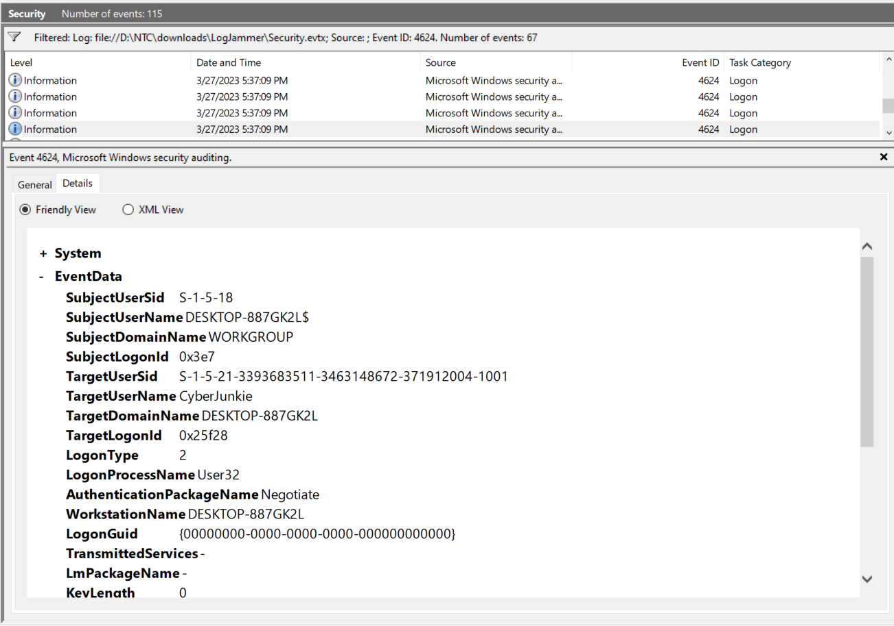
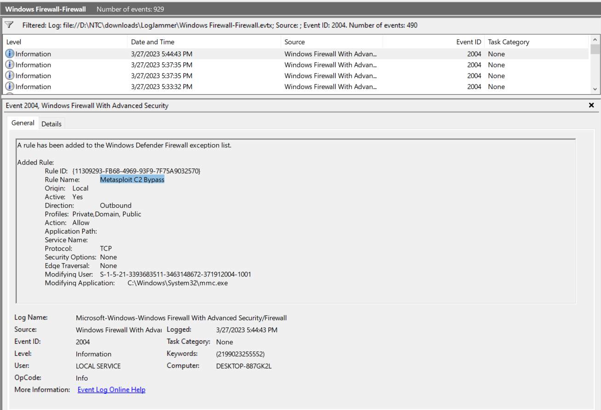
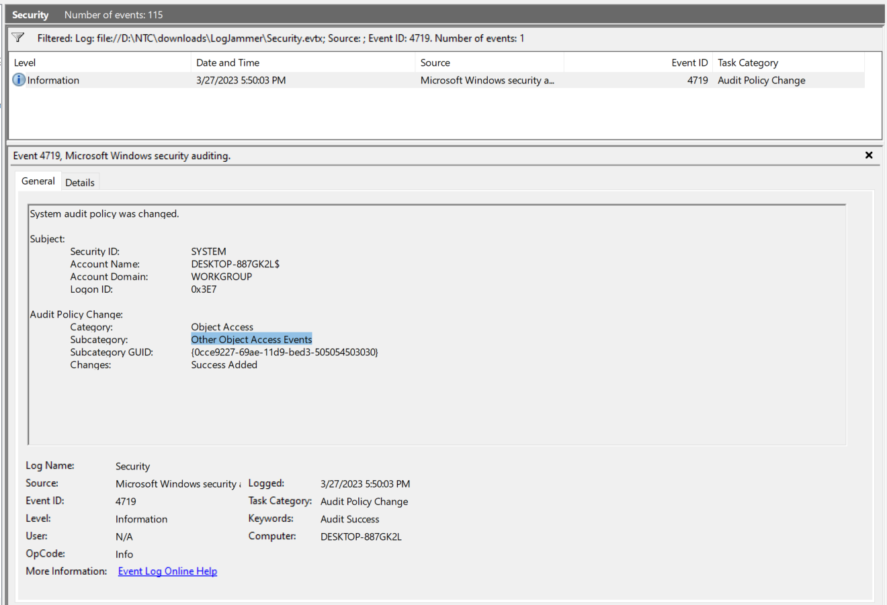
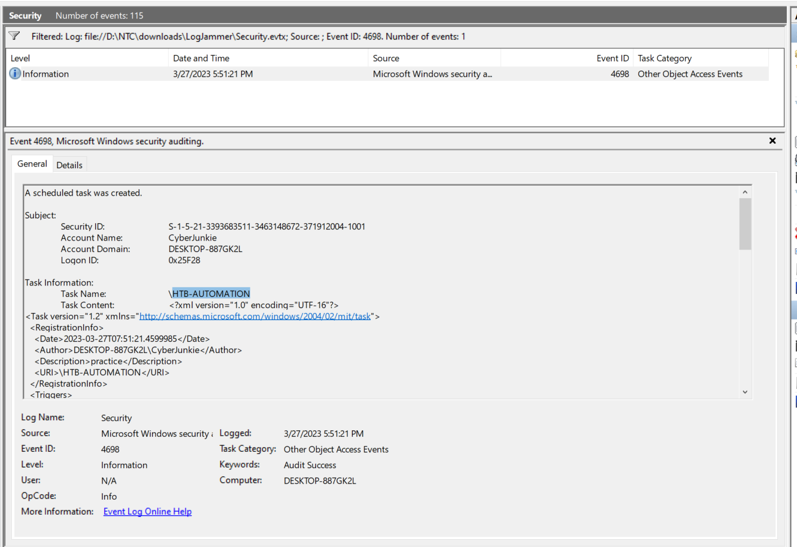
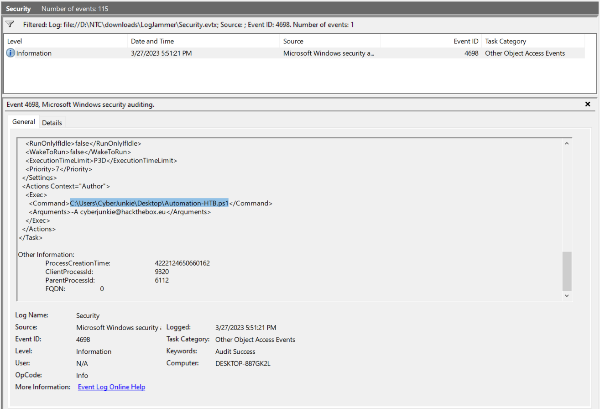
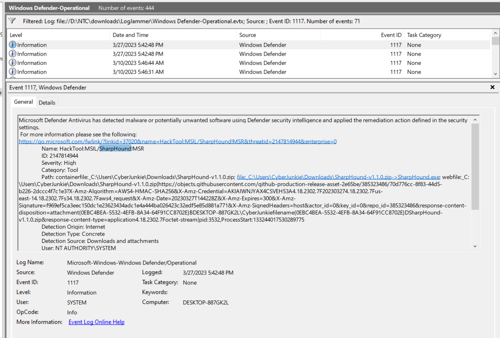
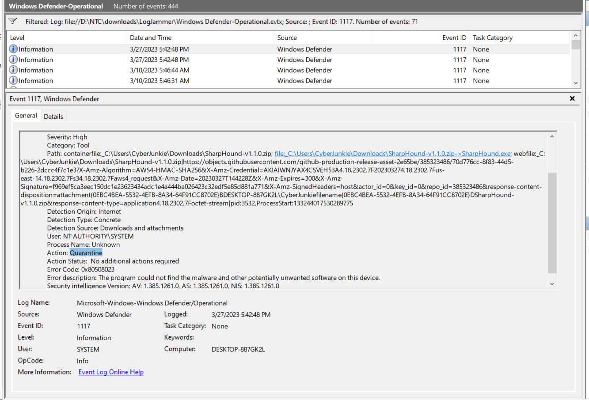
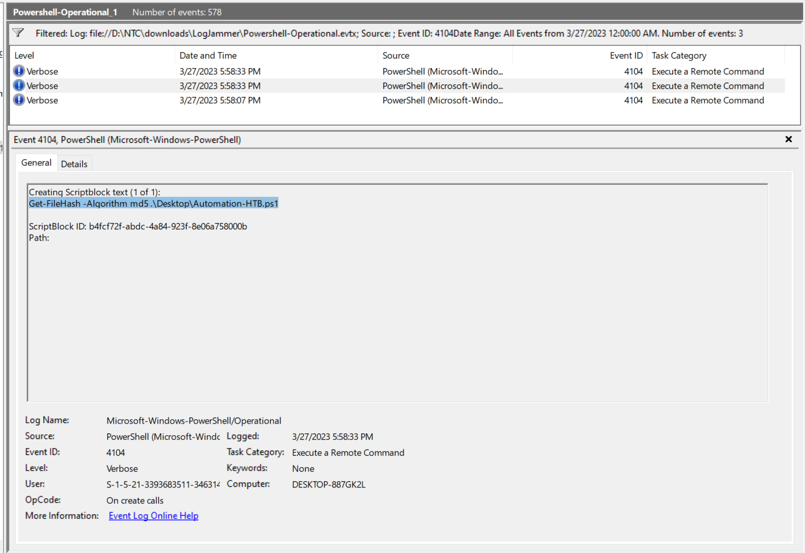
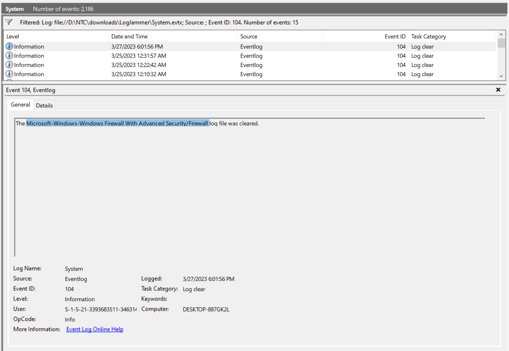

### Sherlock Scenario

You have been presented with the opportunity to work as a junior DFIR consultant for a big consultancy. However, they have provided a technical assessment for you to complete. The consultancy Forela-Security would like to gauge your knowledge of Windows Event Log Analysis. Please analyse and report back on the questions they have asked.

### Answers

#### Task 1

When did the cyberjunkie user first successfully log into his computer? (UTC)

Successful logons can be tracked using Event ID 4624

3/27/2023 5:37:09 PM -> 3/27/2023 02:37:09 (UTC)

Answer: 27/03/2023 14:37:09

#### Task 2

The user tampered with firewall settings on the system. Analyze the firewall event logs to find out the Name of the firewall rule added?

when any firewall rule is added (including via command line or advanced configuration) we can track it via Event ID 2004 in the firewall logs.

Answer: Metasploit C2 Bypass

#### Task 3

Whats the direction of the firewall rule?

Answer: Outbound

#### Task 4

The user changed audit policy of the computer. Whats the Subcategory of this changed policy?

Windows Event ID 4719 is logged when the system audit policy is modified, and we can track it via the security logs.

Answer: Other Object Access Events

#### Task 5

The user "cyberjunkie" created a scheduled task. Whats the name of this task?

When a scheduled task is created, event ID 4698 is created.

Answer: HTB-AUTOMATION

#### Task 6

Whats the full path of the file which was scheduled for the task?

Scroll down in the same event

Answer: C:\Users\CyberJunkie\Desktop\Automation-HTB.ps1

#### Task 7

What are the arguments of the command?

Another question to be answered from the same event.

Answer: -A cyberjunkie@hackthebox.eu

#### Task 8

The antivirus running on the system identified a threat and performed actions on it. Which tool was identified as malware by antivirus?

Event ID 1117: Microsoft Defender Antivirus has detected malware or potentially unwanted software using Defender security intelligence and applied the remediation action defined in the security settings.

After Filtering, we've got 71 Events, and all of them have been generated by CyberJunkie.

SharpHound -> Category: Tool
Meterpreter -> Category: Trojan

Answer: SharpHound

#### Task 9

Whats the full path of the malware which raised the alert?

Answer: C:\Users\CyberJunkie\Downloads\SharpHound-v1.1.0.zip

#### Task 10

What action was taken by the antivirus?

From the same event:

Answer: Quarantine

#### Task 11

The user used Powershell to execute commands. What command was executed by the user?

By Filtering for event ID 4104 in the powershell logs, we can track the execution of a Remote Command.

We have a huge amount of events, but by filtering the events to be in 3/27/2023 or later we will got 3 events.

Answer: Get-FileHash -Algorithm md5 .\Desktop\Automation-HTB.ps1

#### Task 12

We suspect the user deleted some event logs. Which Event log file was cleared?

By filtering for event ID 104 in the system logs, we can catch any clearance for event logs:

Answer: Microsoft-Windows-Windows Firewall With Advanced Security/Firewall

