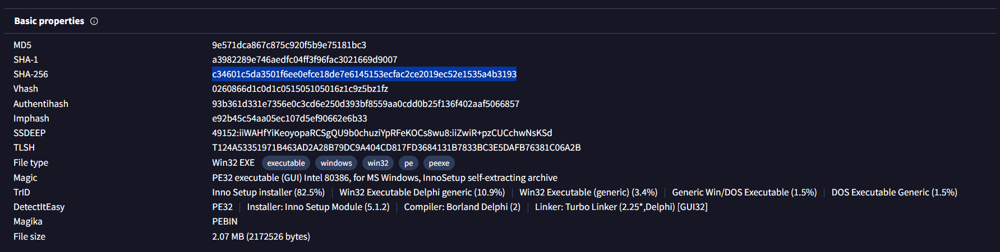
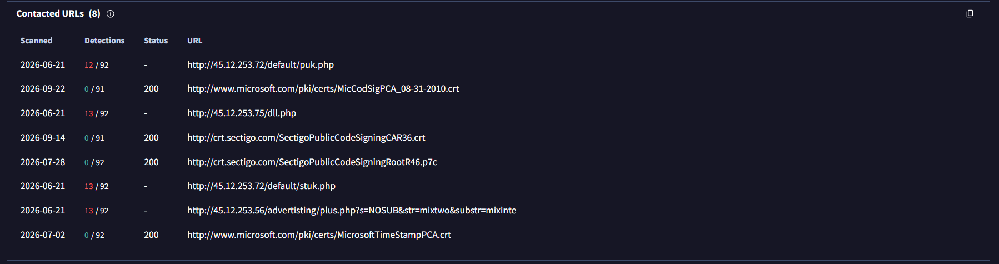
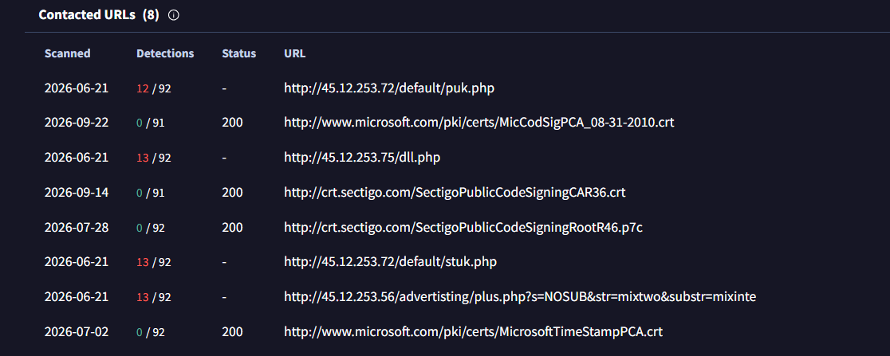

### Sherlock Scenario

John Grunewald was deleting some old accounting documents when he accidentally deleted an important document he had been working on. He panicked and downloaded software to recover the document, but after installing it, his PC started behaving strangely. Feeling even more demoralised and depressed, he alerted the IT department, who immediately locked down the workstation and recovered some forensic evidence. Now it is up to you to analyze the evidence to understand what happened on John's workstation.

### Answers

In this scenario we've provided with multiple forensics artifacts; disk artifacts, memory capture, and packet capture.

#### Task 1

What is the build version of the operating system?

By analyzing the memory image, and grabbing the info using windows.info plugin we can get the answer:

```bash
vol -f ~/Desktop/CDSA/Trojan/memory\ capture/memory.vmem windows.info
```

You will find the answer in the major/minor field

Answer: 19041

#### Task 2

What is the computer hostname?

The hostname is stored in the SYSTEM registry hive, so you can read it with printkey plugin:

```bash
vol -f ~/Desktop/CDSA/Trojan/memory\ capture/memory.vmem windows.registry.printkey --key "ControlSet001\Control\ComputerName\ComputerName"
```

Answer: DESKTOP-38NVPD0

#### Task 3

What is the name of the downloaded ZIP file?

To list the files we will use filescan plugin, and will filter for the files in downloads directory to get the answer:

```bash
vol -f ~/Desktop/CDSA/Trojan/memory\ capture/memory.vmem windows.filescan | grep -i downloads
```

Answer: Data_Recovery.zip

#### Task 4

What is the domain of the website (including the third-level domain) from which the file was downloaded?

We can search in the memory dump image for it:

```bash
strings -a -el ~/Desktop/CDSA/Trojan/memory\ capture/memory.vmem | grep -i "Data_Recovery.zip" | grep -iE "https?://"
```

Answer: praetorial-gears.000webhostapp.com

#### Task 5

The user then executed the suspicious application found in the ZIP archive. What is the process PID?

We will need to dump the process list and filter for recovery:

```bash
vol -f ~/Desktop/CDSA/Trojan/memory\ capture/memory.vmem windows.pslist | grep -i recovery
```

Answer: 484

#### Task 6

What is the full path of the suspicious process?

We will use filescan plugin again, and will filter for the name of the process from the previous task: 

```bash
vol -f ~/Desktop/CDSA/Trojan/memory\ capture/memory.vmem windows.filescan | grep -i Recovery_Setup
```

Answer: C:\Users\John\Downloads\Data_Recovery\Recovery_Setup.exe

#### Task 7

What is the SHA-256 hash of the suspicious executable?

I tried to dump the process image to get it's hash, and tried to extract the file as Windows cached it, and tried to extract the exe from the zip file, but none of these worked.

So I used windows.registry.amcache plugin, Amcache (`C:\Windows\AppCompat\Programs\Amcache.hve`) is a registry hive Windows uses for application compatibility. When a program runs, Windows logs details about it there: the full path, file size, compile time, publisher, and a SHA-1 hash of the file as it existed on disk. Windows computed that hash from the complete original file, before any of it was lost from memory.

```bash
vol -f ~/Desktop/CDSA/Trojan/memory\ capture/memory.vmem windows.registry.amcache | grep -i recovery
```

I've got the sha1 hash for the file, but the task asked for sha256, so I used the hash to lookup in virustotal, and I've got the answer in the details section.



Another way to get it is via the network capture we have:

First we will extract the objects using wireshark or tshark: 

```bash
tshark -r network.pcapng --export-objects http,exported
```

then we can unzip the zip file and run the sha265sum command:

```bash
unzip Data_Recovery.zip
sha256sum Recovery_Setup.exe 
```

Answer: C34601c5da3501f6ee0efce18de7e6145153ecfac2ce2019ec52e1535a4b3193
#### Task 8

When was the malicious program first executed?

You can get it from the same Amcache output

Answer: 2023-05-30 02:06:29

#### Task 9

How many times in total has the malicious application been executed?

The memory Dump haven't help at all, so I moved to the disk artifacts, The disk evidence is an AccessData logical image (`.ad1`), I extracted it on Linux using AD1-tools:

```bash
git clone https://github.com/al3ks1s/AD1-tools.git && cd AD1-tools 
./autogen.sh && ./configure && make 
sudo ./AD1Tools/ad1extract -i disk_artifacts.ad1 -d extracted 
sudo chown -R $USER:$USER extracted
```

Searching for the prefetch file name in the memory dump to know where to search in the disk:

```bash
strings -a -el memory.vmem | grep -i "RECOVERY_SETUP.EXE-" | sort -u
```

That gave `C:\Windows\Prefetch\RECOVERY_SETUP.EXE-A808CDAB.pf`. The full file came from the disk artifacts:

```bash
cd ~/Desktop/CDSA/Trojan/extracted 
find . -iname "*A808CDAB*"
```

Then by this command We've got both the run count and the file name for the next task:

```bash
sudo apt install libscca-utils 
sccainfo "$(find . -iname '*A808CDAB*' | head -1)" | grep -iE "run count|is-"
```

Answer: 2
#### Task 10

The malicious application references two .TMP files, one is IS-NJBAT.TMP, which is the other?

Answer: IS-R7RFP.TMP

#### Task 11

How many of the URLs contacted by the malicious application were detected as malicious by VirusTotal?



The total is 8, but the detected is 4

Answer: 4

#### Task 12

The malicious application downloaded a binary file from one of the C2 URLs, what is the name of the file?

Here, we will go again to the packet capture, lets start by listing the HTTP requests:

```bash
tshark -r network.pcapng  -Y 'http.request' -T fields -e frame.time_utc -e ip.dst -e http.host -e http.request.method -e http.request.uri
```

From the output with suspicious IP that could be related to a C2 server, this line is intresting:

```text
45.12.253.72    45.12.253.72    GET     /default/puk.php
```

We can confirm from the relations page in virus total:



Answer: puk.php

#### Task 13

Can you find any indication of the actual name and version of the program that the malware is pretending to be?

First of all, we'll need to find where the installer dropped its files, the installer's version resource (from the PID 484 process dump) identifies it as an Inno Setup package named "FLSCover", version 1.0.5.28. Searching memory for that name shows where it installed:

```bash
strings -a -el memory.vmem | grep -i "flscover" | sort | uniq -c | sort -rn | head
```

Everything points to `C:\Program Files (x86)\FLSCover\Rec528\`.

Then list the dropped files:

```bash
vol -f memory.vmem windows.filescan | grep -i rec528
```

The folder contains `Rec528.exe`, `Preview.exe`, `unins000.exe`, `data\Config.xml`, `Readme.txt`, and a help file whose name starts with `finalrecover...`. `Rec528.exe` is also running as PID 4012, started at 02:08:01 UTC.

Lets try to recover the Readme contents from memory:

Dumping `Readme.txt` with `windows.dumpfiles` returned an empty file because its pages weren't resident. 

Its text still survives elsewhere in memory, so a string search recovers it:

```bash
strings -a memory.vmem | grep -i "finalrecovery" | sort -u
```

The output includes the product description ("FinalRecovery is a powerful and easy-to-use file recovery software..."), the help file `finalrecovery.chm`, and the vendor's contact addresses at `finalrecovery.com`.

To get the version, show the lines just above the product description, where readme files usually put the title and version:

```bash
strings -a "$M" | grep -B6 "FinalRecovery is a powerful" | head -20
```

Answer: FinalRecovery v3.0.7.0325