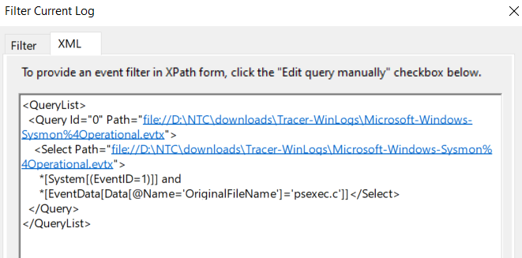
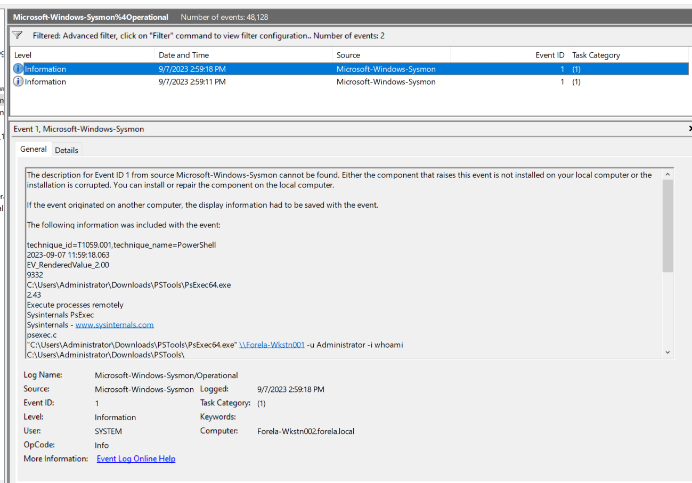
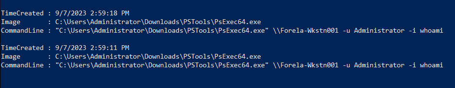
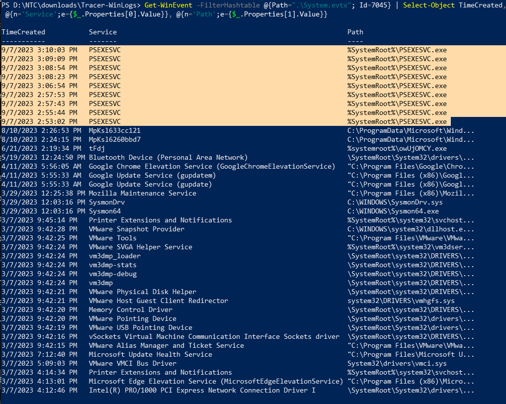
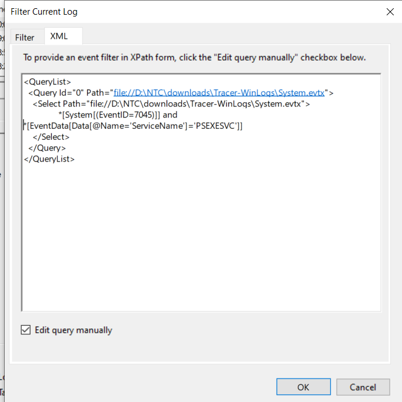
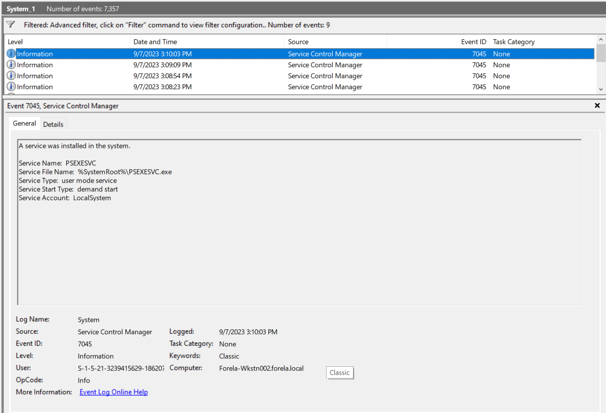
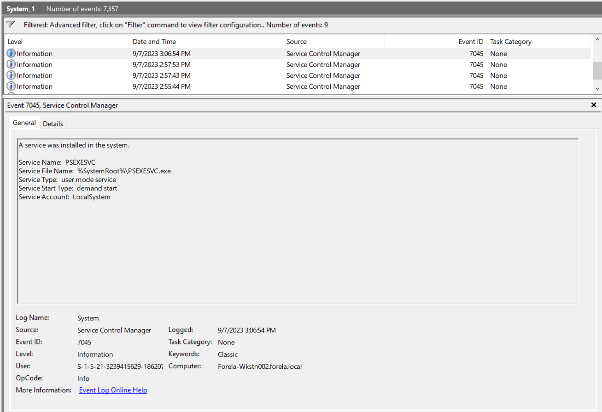
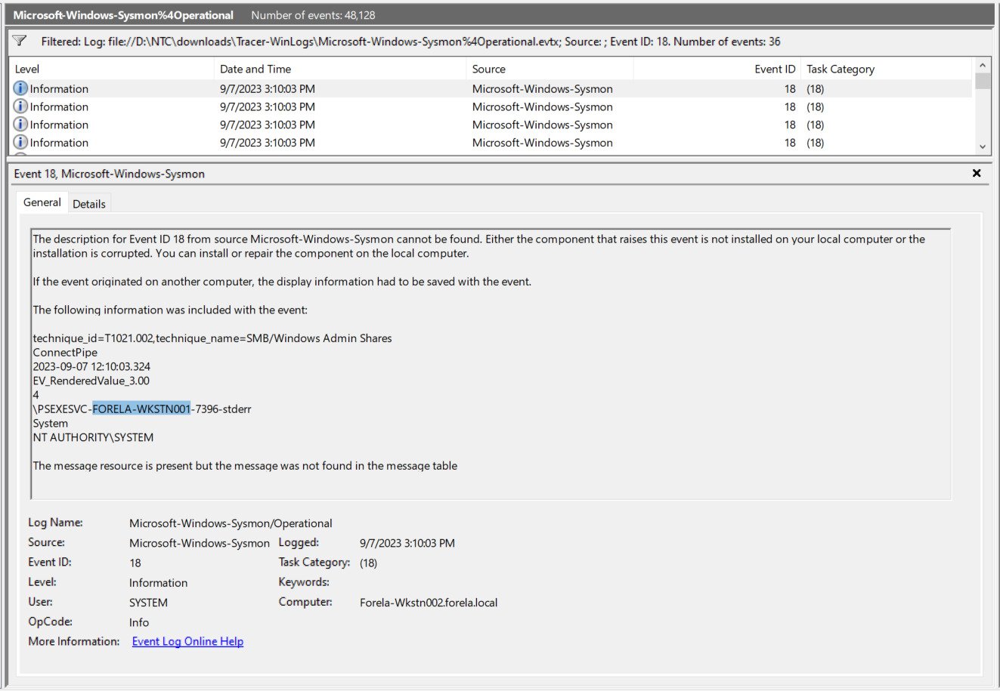
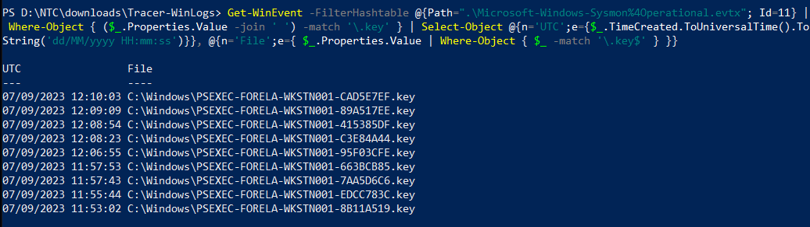
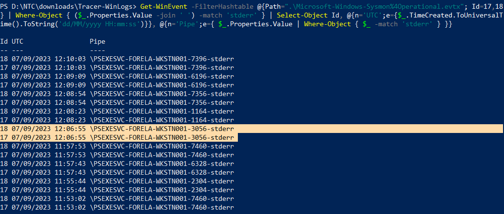

### Sherlock Scenario

A junior SOC analyst on duty has reported multiple alerts indicating the presence of PsExec on a workstation. They verified the alerts and escalated the alerts to tier II. As an Incident responder, you triaged the endpoint for artifacts of interest. Now, please answer the questions regarding this security event so you can report it to your incident manager.

### Answers

#### Task 1

The SOC Team suspects that an adversary is lurking in their environment and are using PsExec to move laterally. A junior SOC Analyst specifically reported the usage of PsExec on a WorkStation. How many times was PsExec executed by the attacker on the system?

In this scenario, we've provided with high amount of log files, for this task we will look for event ID 1 in the Microsoft-Windows-Sysmon%4Operational.evtx:

We can get the answer in multiple ways, the first is to filter for event id 1 in Event viewer then do a simple editing in the XML query By adding: 

```xml
*[EventData[Data[@Name='OriginalFileName']='psexec.c']]
```





The second way is to use Get-WinEvent in powershell:

```powershell
$events = Get-WinEvent -FilterHashtable @{Path=".\Microsoft-Windows-Sysmon%4Operational.evtx"; Id=1} |
  Where-Object { $_.Properties[4].Value -match '\\PsExec(64)?\.exe$' -or $_.Properties[9].Value -eq 'psexec.c' } |
  Select-Object TimeCreated,
    @{n='Image';e={$_.Properties[4].Value}},
    @{n='CommandLine';e={$_.Properties[10].Value}}

$events | Format-List
$events.Count
```



But the answer is not 2! 

If we focused again in the question, the key word is "on the system." The question is about the workstation _receiving_ the PsExec executions, not the machine launching them. The two events you found are `PsExec64.exe` itself, the client side. On a target, each remote execution shows up as the PSEXESVC service running instead.

Lets try to filter for service installs in System.evtx (7045).Each PsExec run normally installs the service again:

```powershell
Get-WinEvent -FilterHashtable @{Path=".\System.evtx"; Id=7045} | Select-Object TimeCreated, @{n='Service';e={$_.Properties[0].Value}}, @{n='Path';e={$_.Properties[1].Value}}
```



The second way is to search via Event viewer and edit the XML filter:

```xml
*[EventData[Data[@Name='ServiceName']='PSEXESVC']]
```





Answer: 9

#### Task 2

What is the name of the service binary dropped by PsExec tool allowing attacker to execute remote commands?

We've already got the answer from the previous task.

Answer: psexesvc.exe

#### Task 3

Now we have confirmed that PsExec ran multiple times, we are particularly interested in the 5th Last instance of the PsExec. What is the timestamp when the PsExec Service binary ran?



9/7/2023 3:06:54 PM -> 07/09/2023 12:06:54 PM (UTC)

We can get it also via powershell Get-WinEvent cmdlet:

```powershell
$ps = Get-WinEvent -FilterHashtable @{Path=".\System.evtx"; Id=7045} | Where-Object { $_.Properties[0].Value -eq 'PSEXESVC' }
$ps | Select-Object @{n='UTC';e={$_.TimeCreated.ToUniversalTime().ToString('dd/MM/yyyy HH:mm:ss')}}
$ps[4].TimeCreated.ToUniversalTime().ToString('dd/MM/yyyy HH:mm:ss')
```

Answer: 07/09/2023 12:06:54

#### Task 4

Can you confirm the hostname of the workstation from which attacker moved laterally?

We can get it by looking for event ID 18 This event generates when a named pipe is created. Malware often uses named pipes for interprocess communication, (or 17) -> both event IDs will show the hostname:



We can do it also using Get-WinEvent:

```powershell
Get-WinEvent -FilterHashtable @{Path=".\Microsoft-Windows-Sysmon%4Operational.evtx"; Id=17,18} | Where-Object { $_.Properties[5].Value -match 'PSEXESVC-' } | Select-Object @{n='UTC';e={$_.TimeCreated.ToUniversalTime()}}, @{n='Pipe';e={$_.Properties[5].Value}}
```

Answer: FORELA-WKSTN001

#### Task 5

What is full name of the Key File dropped by 5th last instance of the Psexec?

We'll look for Sysmon Event 11 (FileCreate):

```powershell
Get-WinEvent -FilterHashtable @{Path=".\Microsoft-Windows-Sysmon%4Operational.evtx"; Id=11} | Where-Object { ($_.Properties.Value -join ' ') -match '\.key' } | Select-Object @{n='UTC';e={$_.TimeCreated.ToUniversalTime().ToString('dd/MM/yyyy HH:mm:ss')}}, @{n='File';e={ $_.Properties.Value | Where-Object { $_ -match '\.key$' } }}
```



This matches on any field containing `.key`, so it doesn't depend on getting the TargetFilename index right. The output lists each key file with its creation time.

Answer: PSEXEC-FORELA-WKSTN001-95F03CFE.key

#### Task 6

Can you confirm the timestamp when this key file was created on disk?

We can get it from the previous task output.

Answer: 07/09/2023 12:06:55

#### Task 7

What is the full name of the Named Pipe ending with the "stderr" keyword for the 5th last instance of the PsExec?

We can get it by filtering for any of the event IDs 17 (Pipe Created) and 18 (Pipe Connected) and specify for stderr:

```powershell
Get-WinEvent -FilterHashtable @{Path=".\Microsoft-Windows-Sysmon%4Operational.evtx"; Id=17,18} | Where-Object { ($_.Properties.Value -join ' ') -match 'stderr' } | Select-Object Id, @{n='UTC';e={$_.TimeCreated.ToUniversalTime().ToString('dd/MM/yyyy HH:mm:ss')}}, @{n='Pipe';e={ $_.Properties.Value | Where-Object { $_ -match 'stderr' } }}
```



Answer: \PSEXESVC-FORELA-WKSTN001-3056-stderr

### Final Note

This sherlock was the most challenging till now, so being able to solve it is a great step, also in this sherlock we were provided with multiple log files and prefetch files, but being able to know where to search is the key.

