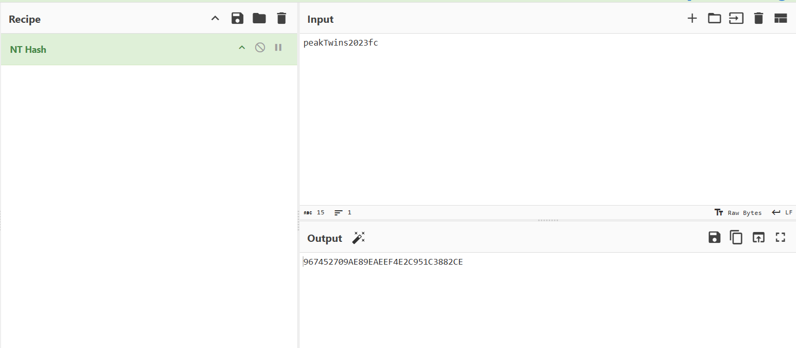
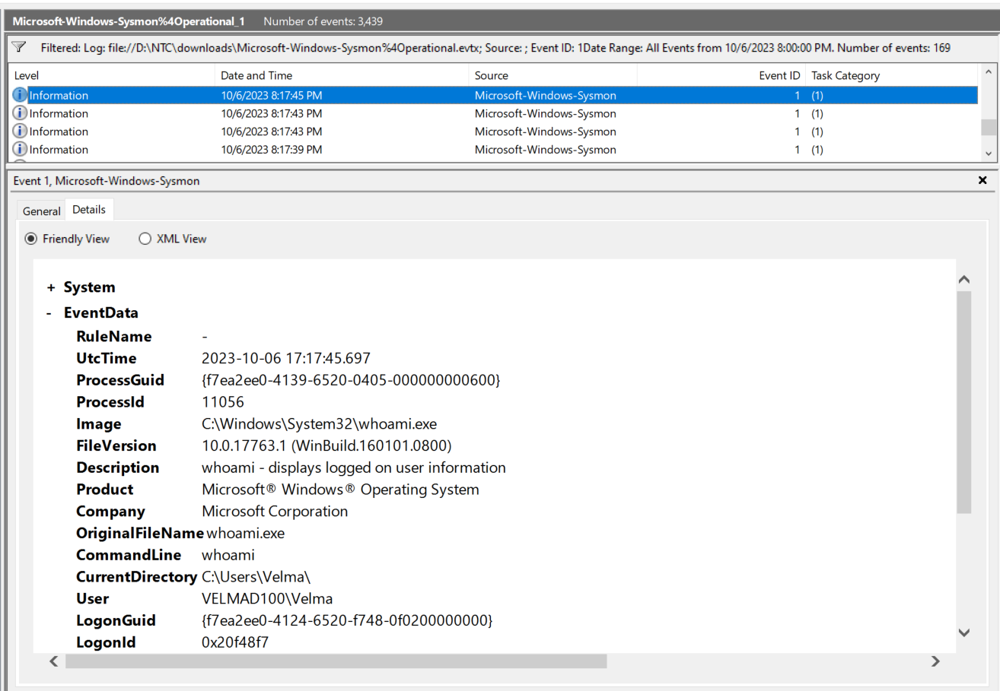
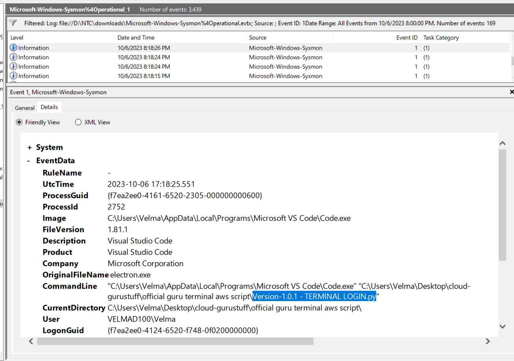
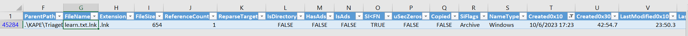
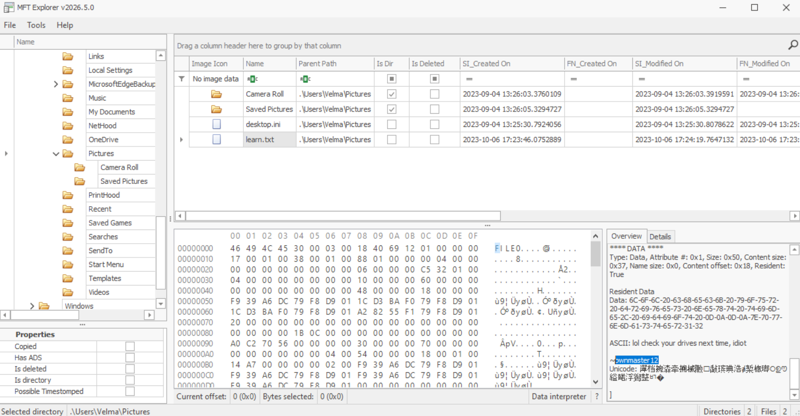

### Sherlock Scenario

You’re a third-party IR consultant and your manager has just forwarded you a case from a small-sized startup named cloud-guru-management ltd. They’re currently building out a product with their team of developers, but the CEO has received word of mouth communications that their Intellectual Property has been stolen and is in use elsewhere.

The user in question says she may have accidentally shared her Documents folder and they have stated they think the attack happened on the 6th of October. The user also states she was away from her computer on this day.

There is not a great deal more information from the company besides this. An investigation was initiated into the root cause of this potential theft from Cloud-guru; however, the team has failed to discover the cause of the leak. They have gathered some preliminary evidence for you to go via a KAPE triage. It’s up to you to discover the story of how this all came to be. ** Warning : This Sherlock requires an element of OSINT and players will need to interact with 3rd party services on the internet.**

### Answers

#### Task 1

Which folders were shared on the host? (Please give your answer comma separated, like this: c:\program files\share1, D:\folder\share2)

Windows keeps every user-created SMB share in the registry, so the SYSTEM hive tells you exactly what was exposed. (`SYSTEM\ControlSet001\Services\LanmanServer\Shares`)

LanmanServer is the "Server" service, the component that serves files over SMB. When a user right-clicks a folder and chooses "Give access to" or "Share", Windows writes one value under this key per share. On boot, the service reads the key and re-publishes those shares, which is why they persist.

The KAPE triage included the SYSTEM hive at `TriageData/C/Windows/system32/config/SYSTEM`. Since a hive is a binary file, I parsed it offline with RegRipper's `shares` plugin:

```bash
cd Jinkies_KAPE_output/TriageData/C/Windows/system32/config
regripper -r SYSTEM -p shares
```

Answer: `C:\Users\Velma\Documents, C:\Users`

#### Task 2

What was the file that gave the attacker access to the user's account?

If we go to one of the shared folders which is Documents, we will notice inside it a file that I feel that it is suspicious: bk_db.ibd

Why this file?

- An `.ibd` file is a MySQL InnoDB tablespace, meaning the raw data of one database table. The folder name `bk` and the file name suggest a backup of the database behind the "logon website" project.
- A login site's database holds usernames and password hashes. If Velma registered a test account with the same password she uses for Windows, cracking her hash gives the attacker her account.
- It is inside a folder reachable over SMB (Task 1), so the attacker could simply copy it.

Answer: `bk_db.ibd`

#### Task 3

How many user credentials were found in the file?

```bash
strings bk_db.ibd | grep -c '@gmail' 
```

Answer: 216

#### Task 4

What is the NT hash of the user's password?

```bash
strings bk_db.ibd | grep -i velma
```

We've got this password: peakTwins2023fc

We will need to hash it to NT, I used CyberChef:



Answer: `967452709ae89eaeef4e2c951c3882ce`

#### Task 5

Is the user's computer password the same as the password found in the ibd file? (Yes or No)

To confirm this, we'll need to extract Velma's actual NT hash from the hives in the triage and see if it matches or no:

```bash
cd Jinkies_KAPE_output/TriageData/C/Windows/system32/config
impacket-secretsdump -sam SAM -system SYSTEM LOCAL
```

The structure to look: `Velma:<RID>:<LM>:<NT>:::`

Velma's NT hash: `967452709ae89eaeef4e2c951c3882ce`, which match the hash We've already got

Answer: Yes

#### Task 6

What was the time the attacker first interactively logged on to our user's host?

By looking for security.evtx in Event viewer and filtering for event ID 4624 and looking for events related to Velma, I got multiple events, the events related to a remote IP returned incorrect answer, so honestly I've bruteforce it by trying all related times then got the answer. (Don't forgot to convert to UTC)

Answer: 2023-10-06 17:17:23

#### Task 7

What's the first command the attacker issues into the Command Line?

By Filtering for event ID 4104 in the powershell logs, we can track the execution of a Remote Command.

I've looked into Microsoft-Windows-PowerShell%4Operational.evtx, but there is no events related to the incident time.

So I decided to look into `Windows Powershell.evtx`, but also the same

This means that the attacker used cmd.exe not powershell.exe, so lets take a look at event ID 1 (ProcessCreate) in Microsoft-Windows-Sysmon%4Operational.evtx:

We already know when the attacker have gained access, so filter it to only show the events after it.



Answer: whoami

#### Task 8

What is the name of the file that the attacker opens in VSCode shortly before launching the web browser?

By looking in the same filter you will find it:



Answer: `Version-1.0.1 - TERMINAL LOGIN.py`

#### Task 9

What's the domain name of the location the attacker likely exfiltrated the file to?

In the `Jinkies_KAPE_output/TriageData/C/users/Velma/Appdata/Local/Google/Chrome/User Data/Default`  you will find a file called History, which is Sqlite3 DB file which contains the browser history.

And by executing this SQL command we will get our answer:

```sqlite3
SELECT datetime(last_visit_time/1000000-11644473600,'unixepoch') AS visit,
        url, title
 FROM urls
 ORDER BY last_visit_time;
```

Answer: Pastes.io

#### Task 10

What is the handle of the attacker?

**$MFT (Master File Table)** is NTFS's master database of every file and folder on a volume — one entry per item, holding metadata like timestamps, size, and permissions. It sits at the root of the system drive.

**Why forensics cares:** Since it logs every file's metadata, analysts can reconstruct a timeline of creation, modification, and access activity across the whole system.

**Key feature:** MFT entries often survive file deletion, so investigators can recover evidence (names, timestamps, sizes) of files a user thought they'd erased — even without the file content itself.

So lets use MFTECmd.exe against the $MFT file:

```powershell
 .\MFTECmd.exe -f 'D:\NTC\downloads\jinkies\Jinkies_KAPE_output\TriageData\C\$MFT' --csv . --csvf mft.csv
```

The output is huge, so to know were to look, we will follow the timeline after the attacker logged in, when filtering the column Created0x10 to 10/6/2023 we will got 1 entry which shows a file named `learn.txt`.



But there is no details here, so I uploaded the $MFT file to MFTExplorer and located the file:



There is Ascii text left : "lol check your drives next time, idiot" and the attacker handle.

Answer: pwnmaster12

